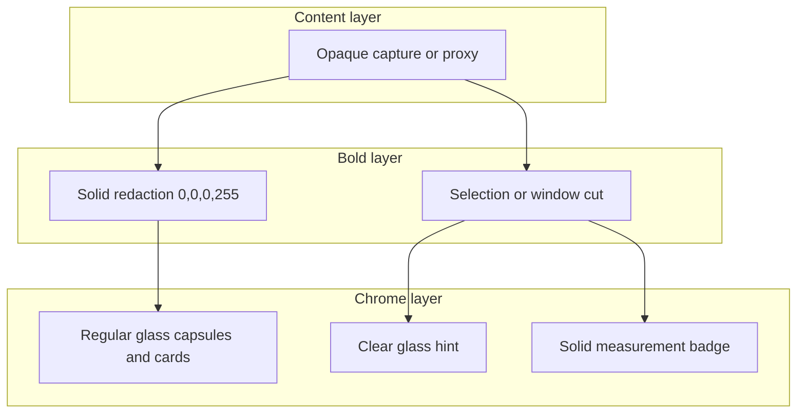

# Registration: Frisket visual and interaction system

| | |
| --- | --- |
| Author | Frisket design |
| Date | 2026-09-24 |
| Status | Draft |
| Product | Frisket, menu-bar macOS screenshot app |
| Floor | macOS 26.0, SDK `MacOSX.sdk` from Xcode 26.5 (`SDKROOT = macosx26.5` in `Frisket.xcodeproj/project.pbxproj`) |
| Audience | Senior engineers implementing the app target and `FrisketCore` |

This is a plan. It does not change capture behaviour, the shortcut model, retention, the redaction pixel contract, or the repository.

## Overview

Frisket’s surfaces are stock AppKit and SwiftUI literals: a 288 pt material card, wordy push buttons, a 24% black selection veil with a middle-dot instruction, and no shared tokens. The captured image is the product, and the interface currently competes with it.

**Registration** treats a frisket as a cut mask. The one bold element is that mask: the selection cut-out, the window cut-out, and the opaque-black redaction. Everything else is quiet macOS 26 chrome. Captured pixels stay on the system window or under-page background. Controls sit in untinted Liquid Glass, or in a solid system fill when the display asks for less transparency or more contrast. Type is the system font. Measurement text uses monospaced digits only. Annotation ink is a closed set of four baked colours, none of them the redaction black.

An engineer can implement each surface from the numbers, strings, and states in this document without choosing spacing, type, colour, or copy.

## Background and motivation

Accepted product decisions in `.scratch/screenshot-mvp/decisions.md` already fix what Frisket does. Decision 54 (2026-09-23) says the owner will not choose among design forks; the best-evidenced option is recorded and used. The interface was built to make the capture loop true, not to look considered. Colours, radii, and type sizes are literals at each call site. There is no token type.

What a person sees today:

- The thumbnail reads as a small form (`Frisket/ThumbnailPanel.swift`).
- The editor is two rows of titled `NSButton`s on an `NSVisualEffectView` of material `.menu` (`Frisket/EditorWindow.swift`).
- Selection is a flat dim, a 1 px white stroke, and a 13 pt middle-dot sentence (`Frisket/Adapters/SelectionOverlay.swift`, `Frisket/Adapters/SelectionSizeBadge.swift`).
- The status item starts as a template `camera.viewfinder`, then `refreshPermissionIndicator()` replaces it (`Frisket/FrisketApp.swift`).
- History, onboarding, About, permission, and Settings use default SwiftUI stacks.

The app is replacing CleanShot for personal use (decision 55). The bar is CleanShot’s speed and density, Shottr’s measurement and keyboard precision, and Apple’s macOS 26 material rules. It is not a reskin of those apps.

## Goals and non-goals

### Goals

- One token source for space, type, radius, motion, elevation, chrome materials, and baked ink.
- Every interactive surface specified in points, states, and the file that owns it.
- Full keyboard operation of capture and the thumbnail, kept as implemented.
- VoiceOver labels kept, and announcements shortened where they are currently a manual.
- Selection and redaction readable on an arbitrary desktop, including light content inside the cut-out.
- Annotation text that can show real words, with a deterministic pixel contract `FrisketCore` can test without AppKit.
- No added work, motion, or live glass on the capture-latency path. Placeholder remains: thumbnail visible within 500 ms (`CaptureLatency` / `FRISKET_CAPTURE_LATENCY`). Idle CPU stays under 1% when no panel is open.

### Non-goals

- Recording, URL schemes, App Intents, accounts, cloud, hosted sharing, or any format other than PNG.
- History re-edit. History items stay finished images: copy, drag, export, delete.
- A freeform pen, stickers, beautify, frames, device bezels, or gradients on the capture (Xnapper-style treatment).
- Redaction colour, opacity, feather, or corner radius. Fill stays `RGBAPixel(red: 0, green: 0, blue: 0, alpha: 255)` (`SolidRedaction.fill` in `Sources/FrisketCore/EditorDocument.swift`).
- Redo, selecting a mark after mouse-up, or transforming a mark. Undo still pops one whole edit.
- Bundled fonts (Poppins, Lora, Inter, or a display serif).
- macOS 27 APIs: no transparency slider, no Golden Gate sidebar, no new interactive glass bounce. `Glass.interactive(_:)` is not called.
- A coloured menu-bar glyph. The Dock icon is the Icon Composer document in PR 10, not a template image.
- Feature flags. Each pull request is the rollout unit.
- Sandbox, network, or signing changes.

### Invariants this design does not reopen

Personal use, local only. Default export `~/Pictures/Frisket`. History 30 days or 1 GB. Modes: area, window, full screen, manual scrolling. Floating thumbnail with copy, save, drag, edit. Dismissing an unedited thumbnail saves to History. Editor on demand. Unredacted original only in memory; a crash drops the pending capture. Closing a dirty editor asks Finalize / Delete capture / Cancel. Tools remain Solid redaction (R), Crop (C), Arrow (A), Shape (S), Text (T), Blur (B), Magnify (M) (`Frisket/EditorTool.swift`). `FrisketCore` does not import AppKit. English only. Shortcuts stay ⌘⇧1 History, ⌘⇧2 focus latest thumbnail, ⌘⇧3 full screen, ⌘⇧4 area, ⌘⇧5 window, ⌘⇧6 scrolling. Accessory, unsandboxed, debug bundle `io.github.prateeksingh1092.frisket.debug`. Editor shows a 2048 px proxy (`EditorProxy.maxEdge`); full resolution is for Done. Glass on chrome is allowed. Glass on captured pixels is forbidden. The name stays Frisket.

## Proposed design

### Critique against generic tells

Checked against the Anthropic `frontend-design` skill (read 2026-09-24) before the numbers below were fixed.

| Tell | This system |
| --- | --- |
| Warm cream `#F4F1EA` plus terracotta `#D97757` | Not used. That pair is Anthropic’s artifact palette. |
| Near-black field plus one acid accent | Not used. Chrome uses system label and the user’s accent. Redaction black is a pixel fill, not a theme. |
| Broadsheet hairline newspaper | Not used. |
| One radius and `rgba(0,0,0,.1)` on every card | Radii differ by role. One shadow token, and only on panels that float on the desktop. |
| ALL-CAPS eyebrows | Not used. Section titles are sentence case. |
| Middle-dot meta strings | Removed from selection and window capture. |
| `WORD — fragment` | Not used. |
| Tinted near-black standing in for black | Redaction is `0,0,0,255`. Chrome does not fake it. |
| Monospace as decoration | Monospaced digits only for measurements, so the badge does not jitter. |
| Trailing arrow on every button | Not used. |

Boldness is spent once: the cut. Controls are quiet.

### L0. Diagnosis

| Surface | File | What a person sees | Why it lags | What Registration changes |
| --- | --- | --- | --- | --- |
| Thumbnail | `Frisket/ThumbnailPanel.swift` 37–51, 78–122 | Width 288, padding 16, outer radius 18, image max 248×132 radius 10, `.regularMaterial`, two rows of bordered words, caption status | A SwiftUI form on a floating panel. The image is inside the material. | 288×284 card. Image is an opaque sibling, not inside the glass. Symbol row plus one primary Copy. Fixed height so the stack does not overlap. |
| Thumbnail motion | `ThumbnailPanel.swift` 272–285; `Frisket/CaptureSurfaces.swift` 488–504, 418–420 | First show is instant. Later slots animate with the default context. Gap 10, margin 20. Kept state holds 1.2 s. | Default animation duration. Gap is off the space scale. | First show stays instant. Slot move is 180 ms. Gap 8. Kept dwell stays 1.2 s. |
| Editor | `Frisket/EditorWindow.swift` 159–270, 48–88 | Title “Edit Capture”. Stack spacing 4. Push and rounded bezels. Shelf material `.menu` behind the buttons, not wrapping them. Canvas `underPageBackgroundColor`. Guides `systemRed` at 2 or 3 px. Hint 11 pt secondary. | Word buttons, no symbols, separator is the only grouping, dynamic red, glass anti-pattern (effect behind the controls). | Two regular-glass capsules in one container. Symbol tools. Hint 12 pt. Guides use fixed ink or the black redaction stroke. Canvas stays the under-page fill. |
| Area selection | `Frisket/Adapters/SelectionOverlay.swift` 132–162 | 24% black dim, 1 px white stroke, no corner marks. Instruction at (24, 24) in 13 pt white with middle dots. Same string in the accessibility label. | The cut disappears on white windows. The instruction is a manual. | 40% dim, 1 px black outer stroke plus 1 px white inner stroke, 12 pt corner ticks. Scannable hint. Label shortened. Help keeps the keys. |
| Size badge | `Frisket/Adapters/SelectionSizeBadge.swift` 3–20 | 12 pt monospaced digits, white on black 0.72, radius 6, padding 6×3. | No edge on a light cut-out. Drawn in `draw`, which is the right cost. | Same draw path. Black 0.78, 1 px white border, radius 8, padding 8×4. Not a live glass view. |
| Window pick | `Frisket/Adapters/WindowSelectionOverlay.swift` 139–156 | 15% dim, accent fill 0.22 on the window, 2 px white stroke, middle-dot line. | The accent fill tints the content. The stroke fails on white. | Same mask as area selection. The window interior is cleared, not tinted. |
| Status item | `Frisket/FrisketApp.swift` 121–149, 351–359 | Launch image is template `camera.viewfinder`. The next permission refresh replaces it with `camera` or `exclamationmark.triangle.fill` and does not set `isTemplate`. Menu is text-only, plus a disabled sentence. | The audit’s “template viewfinder” is only the first assignment. The fill symbol is a coloured glyph. | Template `camera.viewfinder` when granted. Template `exclamationmark.triangle` when permission is missing. Menu rows gain template symbols. |
| History | `Frisket/HistoryWindow.swift` 114–165, 205–214 | Headline, one sentence, inset list, 96×60 thumb radius 6, text buttons, padding 20, content min 560×520. Window `minSize` is 480×360. | Duplicate title, no measurement style. `minSize` includes the titlebar, so setting it to 560×520 would make the content shorter than the SwiftUI minimum. | Window title carries the name. One caption. Measurement type for dimensions. Content min stays 560×520. Frame `minSize` becomes 560×548. No glass on the thumbnails. |
| Onboarding | `Frisket/OnboardingPanel.swift` 45–66; copy in `Sources/FrisketCore/OnboardingContent.swift` | `VStack` spacing 16, padding 24, `.headline`, five paragraphs. | Default sheet. The shortcut sentence is one compressed line. | 440 pt sheet, symbol rows, shortcut facts on separate lines. Tested phrases stay. |
| About | `Frisket/AboutPanel.swift` 51–82; `Sources/FrisketCore/AboutContent.swift` | 520× padding 24, two headlines, notices scroll 320, Close. | Default stack. | Same facts, padding 20, title 17 pt. No paths, pixels, or diagnostics. |
| Permission | `Frisket/PermissionRecoveryPanel.swift` 31–63 | Width 412, padding 24, spacing 16, headline, four buttons. | Default stack. Explanations are already specific. | Width 420, padding 20. Shorter explanations. Same actions. |
| Settings | `Frisket/ExportSettings.swift` 64–116 hosts the other sections | One grouped `Form` inside a `ScrollView`, padding 8, form min 720×640, window 760×820, `minSize` 640×480. | The form is the right macOS pattern. Explanations are paragraphs. Shortcut rows use `.headline`. `minSize` includes the titlebar, so it cannot equal the SwiftUI content minimum. | `ScrollView` stays. Form min 688×728, padding 16, content 720×760, frame `minSize` 720×788. Row titles become body semibold. |
| Shortcuts | `Frisket/ShortcutSettings.swift` 103–160 | Section essay plus Change / Default. Recording is a key catcher. | The essay is the shortcut manual. | Six short sentences. Rows stay. Recording gets an accent wash. |
| Thumbnails settings | `Frisket/ThumbnailSettings.swift` 49–61 | Toggle, seconds field, “Apply Thumbnail Settings”, one sentence. | The apply button repeats the section name. | Visible title “Apply”. Accessibility label stays specific. |
| History settings | `Frisket/HistorySettings.swift` 97–125 | Days, MB, Apply, usage lines, failure plus Try Again. | Same apply-label issue. Failure copy is already directional. | Visible “Apply”. Usage and failure behaviour unchanged. |
| Export | `ExportSettings.swift` 70–89 | Path, Choose…, iCloud warning, refusal line. | Fine structurally. | Caption shortened. Privacy warnings kept verbatim. |
| Exclusions | `Frisket/CaptureExclusionSettingsView.swift` 9–35 | Section, empty line, name plus bundle id, Remove, Add App… | Default rows. | Tighter caption. Row metrics specified. |
| Scrolling HUD | `Frisket/Adapters/ManualScrollingCapture.swift` 103–158 | Titled panel 280×250. Preview 240×110 at (20, 96). Status 11 pt. Done and Cancel 120×32 with no key equivalents. `becomesKeyOnlyIfNeeded` is true. Placed on `NSScreen.main`, inset 24. | A utility window parked on the page. Preview is inside the titled chrome. A borderless panel cannot take keys unless `canBecomeKey` is overridden. | Borderless 280×236 glass card on the capture display, inset 16. Preview is an opaque sibling. After selection hides, `makeKey` and `makeFirstResponder` so Return, keypad Enter, and Esc arrive. Status is 3 lines and does not truncate. |
| Tokens | Every call site above | None. | Each surface invents numbers. | `RegistrationMetrics` plus `RegistrationChrome`. |

Corrections to the 2026-09-24 audit: the shelf material is `.menu`, not a generic content background. The thumbnail material is `.regularMaterial`. The window veil is 15% black plus an accent wash, not the area veil. The scrolling HUD is an AppKit panel, not SwiftUI. A second menu exists in `installMainMenu()` (`FrisketApp.swift` 188–237) with History on ⌘⌃Y. That equivalent stays; this design does not add or remove shortcuts.

### L1. Principles

1. The mask is the product: the selection cut and the solid-black redaction are the only loud marks, because a frisket exists to keep ink off the protected surface.
2. Pixels are content: the capture is drawn opaque, with no glass, tint, or decorative frame, so the screenshot remains evidence.
3. Chrome is system glass: controls use macOS 26 Liquid Glass or a solid system fill, untinted except a selected control, so Frisket does not invent a second material language.
4. Type is the system voice: SF via `NSFont.systemFont` / SwiftUI `.system`, with monospaced digits only where digits measure pixels.
5. One string, one job: sentence case and active voice; the control that keeps a capture says Keep, and the status that follows says Kept in History.

### L2. Foundations

#### Colour roles

Chrome colours are system colours in the app target. They are not baked into PNGs. Baked colours are `RGBAPixel` values in `FrisketCore`.

| Role | Value | Where |
| --- | --- | --- |
| Mask dim | `NSColor.black` at alpha 0.40 | Area and window overlays only |
| Mask outer stroke | `NSColor.black` alpha 1, 1 px | Cut outline, outside the white stroke |
| Mask inner stroke | `NSColor.white` alpha 1, 1 px | Cut outline, on the cut edge |
| Corner tick | Same two strokes, leg 12 pt, thickness 2 pt | Four corners of the cut |
| Label | `NSColor.labelColor` | Primary chrome text and symbols |
| Secondary | `NSColor.secondaryLabelColor` | Status, hints, metadata |
| Separator | `NSColor.separatorColor` | 1 px rules and image borders |
| Accent wash | `NSColor.controlAccentColor` alpha 0.22 | Selected tool, selected ink, shortcut recording |
| Destructive | SwiftUI `.destructive` / `hasDestructiveAction` | Delete controls only. Not an annotation ink. |
| Canvas ground | `NSColor.underPageBackgroundColor` | Editor canvas behind the proxy |
| Shelf ground | `NSColor.windowBackgroundColor` | Gap between editor capsules |
| Badge fill | `NSColor.black` alpha 0.78 | Measurement badge |
| Badge text | `NSColor.white` | Measurement badge |
| Badge border | `NSColor.white` 1 px | Measurement badge |
| Redaction fill | `RGBAPixel(0, 0, 0, 255)` | Baked. Unchanged. |
| Signal ink | `RGBAPixel(255, 59, 48, 255)` `#FF3B30` | Default baked mark. Equals today’s `DocumentAnnotation.stroke`. |
| Signal halo | `RGBAPixel(255, 255, 255, 255)` | 1 px ring around signal ink |
| Blue ink | `RGBAPixel(10, 132, 255, 255)` `#0A84FF` | Baked alternate |
| Blue halo | `RGBAPixel(255, 255, 255, 255)` | 1 px ring |
| Yellow ink | `RGBAPixel(255, 214, 10, 255)` `#FFD60A` | Baked alternate |
| Yellow halo | `RGBAPixel(28, 28, 30, 255)` `#1C1C1E` | Dark ring. Not redaction black. |
| White ink | `RGBAPixel(255, 255, 255, 255)` | Baked alternate. Code name `paper`. |
| White halo | `RGBAPixel(28, 28, 30, 255)` `#1C1C1E` | Dark ring. Not redaction black. |

No other baked colours exist. Chrome has no brand hex. The six baked hexes are the inks, their halos, and redaction black.

Signal and blue use a white halo because the ink is already dark enough on a light screenshot; the white ring separates them from a dark screenshot and from a black redaction. Yellow and white use `#1C1C1E` because those inks disappear on a light screenshot without a dark ring. The halo is written as opaque pixels. It never samples the capture, so it cannot restore a redacted pixel.

#### Type ramp

Face is the system font. Do not set a font name.

| Token | Size | Weight | Colour role | Use |
| --- | --- | --- | --- | --- |
| caption | 12 pt | regular | secondary, or system red for a failure | Status, hint, metadata |
| body | 13 pt | regular | label | Buttons, fields, sheet sentences |
| headline | 13 pt | semibold | label | Settings section labels, About notices heading, shortcut action names |
| title | 17 pt | semibold | label | Onboarding and About titles. Window titles stay the system titlebar. |
| measurement | 12 pt | medium | badge text, or label on a History row | `NSFont.monospacedDigitSystemFont(ofSize: 12, weight: .medium)` |

Line height is 16 pt for caption and measurement, 18 pt for body, 18 pt for headline, 22 pt for title. Tracking is 0. Alignment is leading, except the measurement badge, which is one centred line inside its pill, and sheet button rows, which are trailing.

#### Space

Scale, in points: 4, 8, 12, 16, 20, 24.

| Token | Value | Use |
| --- | --- | --- |
| space4 | 4 | Gap inside a tool group. Focus ring outset is 2, not on this list. |
| space8 | 8 | Control gap, stack gap, capsule padding relationship, shelf row gap |
| space12 | 12 | Card padding, group gap, sheet row gap |
| space16 | 16 | Floating-panel inset from the visible frame, settings padding, history padding |
| space20 | 20 | Thumbnail stack margin (already 20 in `CaptureSurfaces.layoutThumbnails`) |
| space24 | 24 | Unused by these surfaces. Reserved so a later sheet does not invent 24. |

The thumbnail stack gap changes from 10 to 8. The stack margin stays 20.

#### Radii

Formula, when a rounded image is inset inside rounded chrome: **outer radius = inner radius + padding**.

| Surface | Inner | Padding | Outer |
| --- | --- | --- | --- |
| Thumbnail image inside card | 8 | 12 | 20 |
| Scrolling preview inside card | 8 | 12 | 20 |
| Tool button inside editor capsule | 8 | 4 | 12 |
| Focus ring around a radius-8 control | 8 | 2 outset | 10 |

Continuous corners (SwiftUI `.continuous`, AppKit layer corner curve continuous where a layer is used).

Exceptions, stated so they are not “fixed” later:

- The editor shelf capsules span the content width. Their outer radius is 12 from the formula above, not 20.
- History thumbs are 96×60 at radius 6 and sit in a system list row. The row is not a rounded card, so the formula does not apply.
- The measurement badge radius is 8. It is not nested.
- The selection hint radius is 12. It has no nested shape.
- Editor canvas, redaction, crop, arrows, and shapes have radius 0.

#### Elevation

One token, used only by panels that float on the desktop (thumbnail, scrolling HUD). Not used on History rows, Settings, the editor window (the system window shadow remains), or the selection overlay (`hasShadow` stays false).

| | |
| --- | --- |
| x | 0 |
| y | −6 |
| blur | 18 |
| colour | black alpha 0.22 |

Set `hasShadow = false` on the thumbnail and scrolling panels and attach one `NSShadow` with this token to the glass view’s layer. A system window shadow plus this shadow would double the elevation. History, Settings, and the editor keep the system window shadow and do not add this token. Do not add a second 0.10 black shadow on the inner card.

#### Motion

| Token | Duration | Curve | Use |
| --- | --- | --- | --- |
| slot | 180 ms | ease in and out | Thumbnail origin change after the card is already visible |
| present | 120 ms | ease out | Opacity 0 to 1 when a settings, history, onboarding, about, or permission window opens |
| dismiss | 120 ms | ease in | Opacity 1 to 0, then `orderOut`, for those same windows and for scrolling HUD close |
| select | 80 ms | ease in and out | Selected-tool fill and selected-ink ring |

Reduced motion (`NSWorkspace.shared.accessibilityDisplayShouldReduceMotion`) sets every duration to 0. The change snaps. There is no spring.

Forbidden motion:

- Anything during selection dragging, window hover, or capture. `SelectionPanel.animationBehavior` stays `.none`.
- The first thumbnail `orderFrontRegardless`. It stays instant so the 500 ms path does not wait on an animator.
- A repeating animation, a symbol bounce, or `Glass.interactive`.
- The 1.2 s “Kept in History” dwell is a delay, not an animation. It stays 1.2 s when reduced motion is on.

#### Material map

APIs, verified in this SDK:

- `NSGlassEffectView` (`AppKit/NSGlassEffectView.h`), macOS 26. `contentView`, `cornerRadius`, `tintColor`, `style` = `.regular` or `.clear`.
- `NSGlassEffectContainerView.spacing` is the proximity at which eligible glass descendants **merge**. The header’s default is 0, which batches them and does not merge views that are not touching. Spacing is not the visual gap. The editor container sets `spacing` to 0. The visual gap between the two capsules is the hint band, 8 + 16 + 8 = 32.
- SwiftUI `glassEffect(_:in:)`, `GlassEffectContainer(spacing:content:)`, `glassEffectID`, `glassEffectUnion`. `Glass.regular` and `Glass.clear`. Do not call `interactive` or `identity`.

| View | Material |
| --- | --- |
| Editor tool capsule, editor action capsule | `NSGlassEffectView` `.regular`, tint `nil`, radius 12, inside one `NSGlassEffectContainerView` with `spacing` 0 |
| Thumbnail card chrome | `.regular`, tint `nil`, radius 20. The image is a sibling, not `contentView`. |
| Scrolling HUD chrome | `.regular`, tint `nil`, radius 20. The preview is a sibling, not `contentView`. |
| Selection hint, window hint | No glass. Same solid fill as the measurement badge. The overlay is a `.screenSaver` panel and `draw` fills the dim before the hole, so the hint sits on the veil, not on untouched desktop pixels. |
| Measurement badge | No glass. Solid badge colours in `draw(_:)`. |
| Selection dim and cut | No glass. A fill and a `copy` clear. |
| Editor canvas and every captured image | No glass, no tint, no material. |
| History, Settings, alerts | Standard windows and controls. They pick up system Liquid Glass on macOS 26 without a custom `NSGlassEffectView`. |
| Selected tool, selected ink, shortcut recording | Not a second glass. Accent wash 0.22 on the control. Recording uses that same 0.22, not 0.12. |

Fallback when `accessibilityDisplayShouldReduceTransparency` or `accessibilityDisplayShouldIncreaseContrast` is true:

- Do not create `NSGlassEffectView`.
- Fill `NSColor.windowBackgroundColor`.
- Border 1 px `separatorColor`, or 2 px `labelColor` when increase contrast is on.
- Tint `nil`.
- Corner radius stays the token for that view.
- Rebuild chrome when display options change. The C constant in `NSAccessibility.h` is `NSWorkspaceAccessibilityDisplayOptionsDidChangeNotification`. On this SDK the Swift message identifier is `accessibilityDisplayOptionsDidChange` (`BaseMessageIdentifier<NSWorkspace.AccessibilityDisplayOptionsDidChangeMessage>` in the AppKit swiftinterface). Do not call `NSWorkspace.accessibilityDisplayOptionsDidChangeNotification`; that name is not in the swiftinterface. Also read `NSWorkspace.shared.accessibilityDisplayShouldIncreaseContrast`, `accessibilityDisplayShouldReduceTransparency`, `accessibilityDisplayShouldReduceMotion`, and `accessibilityDisplayShouldDifferentiateWithoutColor`. Do not bake the fallback into a PNG.

`contentView` is mandatory. The editor’s current pattern (effect view behind a sibling stack, `EditorWindow.swift` 250–257) is removed. WWDC25 session 310 is explicit that the glass view must embed the controls as `contentView`.



Glass never sits above `capture`. The mask is either overlay chrome outside the pixels, or opaque black inside them.

### L3. Primitives

Shared metrics. States below are the whole set: default, hover, pressed, selected, disabled, focused, busy.

#### Icon button

File: drawn by `RegistrationChrome.iconButton` in `Frisket/RegistrationChrome.swift`, used from `EditorWindow.swift`.

| | |
| --- | --- |
| Size | 28×28 |
| Symbol | 13 pt medium, `NSImage.SymbolConfiguration(pointSize: 13, weight: .medium)` |
| Radius | 8 |
| Hit target | the 28×28 bounds |

| State | Fill | Symbol | Extra |
| --- | --- | --- | --- |
| default | clear | label | |
| hover | label alpha 0.06 | label | |
| pressed | label alpha 0.12 | label | |
| selected | accent alpha 0.22 | accent | Also a 2 px accent ring, outset 2. A filled symbol is added only when `NSImage(systemSymbolName:)` returns one for that name. `crop.fill`, `arrow.up.right.fill`, `circle.dotted.fill`, and `textformat.fill` do not exist on this Mac. `rectangle.slash.fill` and `rectangle.fill` do. Never append `".fill"` unless that lookup succeeds. |
| disabled | clear | label alpha 0.35 | |
| focused | the state fill | the state symbol | 2 px accent ring, outset 2, radius 10. Increase Contrast uses 3 px. |
| busy | clear | hidden | 16 pt spinning `NSProgressIndicator`, control disabled |

#### Text button

SwiftUI `.bordered` or `.borderedProminent`, or AppKit `.push` at control size `.regular` with the system bezel. Do not clip a custom radius onto a system button. The system bezel is the glass.

| | |
| --- | --- |
| Height | 28 |
| Horizontal padding | 12 |
| Label | body, 13 pt regular |
| Width | hugging, minimum 56, except a pair that shares a row (`Done` / `Cancel`), which is equal width |

| State | Treatment |
| --- | --- |
| default | `.bordered` |
| hover, pressed | system bezel |
| selected | not used on text buttons |
| disabled | system disabled |
| focused | system focus ring |
| busy | disabled, title unchanged |
| primary | `.borderedProminent`. One per surface: thumbnail Copy, editor Keep, onboarding Continue, permission Request when it is present. |
| destructive | `.destructive` or `hasDestructiveAction = true`. Thumbnail Delete Capture, History Delete, editor alert Delete Capture. |

#### Tool button

An icon button plus a key equivalent handled by the editor window, not by `NSButton.keyEquivalent`. Letter equivalents steal keys from the label field once text can contain those letters. See the editor surface.

Tooltip: “\(title) (\(key.uppercased()))”. Accessibility label stays the `EditorTool.accessibilityLabel` string. Selected state is the icon-button selected state. The conceal tool does not get a different bezel. Separation is the group gap and the hint, not a unique button chrome.

#### Field

| | |
| --- | --- |
| Height | 24 |
| Label field width | 160 |
| Numeric field width | 72 |
| Font | body |
| Bezel | `.roundedBezel`, control size `.small` |

| State | Treatment |
| --- | --- |
| default | system field, placeholder secondary |
| hover | system |
| pressed | not used |
| selected | insertion point |
| disabled | alpha 0.35, not editable |
| focused | system focus ring |
| busy | disabled |

Placeholder for the annotation field is `Label`. Maximum 48 filtered characters.

#### Measurement badge

Drawn in `drawSizeBadge` (`SelectionSizeBadge.swift`). Not a view.

| | |
| --- | --- |
| Font | measurement |
| Padding | 8 horizontal, 4 vertical |
| Radius | 8 |
| Fill, text, border | badge tokens |
| Gap above the rect | 6 |
| Clamp | 8 pt inside the overlay bounds. If it does not fit above, place it 6 pt below the rect. |

Text format: `"\(Int(width.rounded())) × \(Int(height.rounded()))"` using U+00D7. Hidden when width or height is under 1, or the string is empty (current guard).

#### Separator

1×16 pt, `separatorColor`, centred in a 12 pt group gap. Not a headline rule.

#### Status line

| | |
| --- | --- |
| Font | caption, 12 pt |
| Min height | 16 |
| Max height | 32, two lines, tail truncation |
| Alignment | leading |
| Failure | `NSColor.systemRed` / SwiftUI `.red` |
| Quiet success | secondary, not green |

#### Focus ring

Icon buttons: 2 px `controlAccentColor`, outset 2, radius = control radius + 2 = 10. Increase Contrast: 3 px. The ring is not an accessibility element. Text buttons, including thumbnail Copy, use the system focus ring on the system bezel. Do not draw a second rounded rect on `.bordered` or `.borderedProminent`. The custom ring at `ThumbnailPanel.swift` 91–97 (radius 6, stroke 2, outset 3) is removed.

### L4. Components

#### Status item

File: `Frisket/FrisketApp.swift`.

Square length. Image always `isTemplate = true`.

| Permission | Symbol | Accessibility label | Tooltip |
| --- | --- | --- | --- |
| granted | `camera.viewfinder` | Frisket capture menu | Capture with Frisket |
| missing | `exclamationmark.triangle` | Frisket capture menu, Screen Recording permission required | Screen Recording permission required |

The 30 s timer while permission is missing stays. It does not animate the symbol. No badge dot, no colour.

#### Status menu row

File: `Frisket/FrisketApp.swift` menu construction.

Template symbol at the menu-item image, `isTemplate = true`. Key equivalents stay whatever `refreshShortcutTitles()` already writes. Rows with no global shortcut keep an empty key equivalent. Do not print C, S, E, T, or Delete on the menu; those keys belong to the focused thumbnail.

| Title | Symbol | Shortcut source |
| --- | --- | --- |
| Capture Area | `rectangle.dashed` | area |
| Capture Window | `macwindow` | window |
| Capture Full Screen | `rectangle.inset.filled` | full screen |
| Capture Scrolling Page | `scroll` | scrolling |
| Focus Latest Thumbnail | `square.on.square` | focus |
| Copy Latest Capture | `doc.on.clipboard` | none |
| Delete Latest Capture | `trash` | none |
| History | `clock` | history |
| Settings… | `gearshape` | ⌘, |
| About Frisket | `info.circle` | none |
| Quit Frisket | none | ⌘Q |

Disabled row, not a command: “Close a thumbnail to keep it in History”. Separators stay where they are: after scrolling, after History, after the disabled row, after Settings. The main menu (`installMainMenu`) gets the same symbols on About, Settings, and History. Its ⌘⌃Y History equivalent stays. The app-menu About item today calls `orderFrontStandardAboutPanel` (`FrisketApp.swift` 205). Point that item at `showAbout` so it opens `AboutPanel`. A symbol on the standard panel does not.

#### Selection mask

File: `Frisket/Adapters/SelectionOverlay.swift`, `SelectionView.draw`.

Full overlay bounds filled with mask dim. The selection rect, in view coordinates, is cleared with `NSColor.clear.setFill()` and `fill(using: .copy)`, which is the current hole. The two strokes do not share an inset. With `s = 1 / scale`:

1. Black path: `selection.insetBy(dx: -0.5 * s, dy: -0.5 * s)`, line width `s`. This is the outer stroke. Its centreline sits half a device pixel outside the rect.
2. White path: `selection.insetBy(dx: 0.5 * s, dy: 0.5 * s)`, line width `s`. This is the inner stroke. Draw it after the black path.

Drawing both on the current `insetBy(0.5 / scale)` stacks them, and the white path covers the black one. That is not this design.

Corner ticks are drawn only while a rect exists. Each tick is an L on the cut, leg 12 pt, thickness `2 / scale` (2 device pixels). White on top of a 1-device-pixel black outer edge. Ticks are not hit targets. Mouse-up still accepts the selection (`mouseUp` calls `acceptSelection`). This design does not add a second, adjustable selection phase.

`invalidateChangedSelection` unions the previous and current selection, each expanded by the 12 pt tick leg, with the badge rect from the formula below. The fixed 8 pt outset at `SelectionOverlay.swift` 169 clips a 12 pt tick and a badge wider than the rect.

#### Size badge

File: `SelectionSizeBadge.swift`, called from area selection and window selection. Both numbers are device pixels, not points. `SelectionGeometry.rect` and `WindowCandidate.frame` are in points (`SelectionGeometry.swift` 1–5, `WindowSelection.swift` 1–4). Multiply by the display’s backing scale, then round with `rounded()` (to nearest, ties away from zero):

- Area: `Int((selection.width * scale).rounded())` and the same for height. `scale` is `SelectionView.scale`, which is `SelectionDisplay.scale` (`backingScaleFactor`).
- Window: the same multiply, using the screen’s `backingScaleFactor` stored on `WindowSelectionView`. Do not print `highlight.width` raw. A window-only pixel multiply would disagree with the area badge. Leaving both in points would disagree with History, which already shows `item.width` × `item.height` pixels.

Format stays `"\(pxW) × \(pxH)"` with U+00D7.

Badge rect, in the overlay’s point space. `textSize` is the measurement font’s size of that string.

```text
badgeW = textSize.width + 16
badgeH = textSize.height + 8
badge = (x: rect.minX, y: rect.maxY + 6, w: badgeW, h: badgeH)
if badge.maxX > bounds.maxX - 8 { badge.x = max(8, bounds.maxX - 8 - badgeW) }
if badge.minX < 8 { badge.x = 8 }
if badge.maxY > bounds.maxY - 8 { badge.y = rect.minY - 6 - badgeH }
if badge.minY < 8 { badge.y = 8 }
```

Fill the badge with black alpha 0.78, radius 8. Stroke a 1 px white border on `badge.insetBy(dx: 0.5, dy: 0.5)` so the border sits inside the badge and is not clipped by the clamp. Draw the text at `(badge.minX + 8, badge.minY + 4)`. Hidden when either pixel dimension is under 1.

#### Selection hint

File: `SelectionOverlay.swift`. Not an `NSGlassEffectView`. The hint is an opaque subview, created once, origin (16, 16). Fill black alpha 0.78, white caption text, 1 px white border, radius 8. That is the badge treatment, so contrast does not depend on `labelColor` against the 0.40 veil or against the desktop under the hole. Do not read pixels out of a glass view to decide if it is blank. There is no glass hint.

The origin display’s hint is hidden while that view’s `dragging` is true, with `isHidden`, no animator. It is shown before the drag and after a drag that does not capture. A non-origin display’s `dragging` stays false, and its hint stays visible for the whole session, including while the origin display is dragging. That hint is the only explanation that the selection will not move onto the other monitor. Hiding every hint because some display is dragging is not this design.

Origin hint size 376×80. Padding 12 horizontal and 8 vertical. Two columns, each 172 pt, gutter 8. 12 + 172 + 8 + 172 + 12 = 376. Four lines at 16 pt is 64, plus 8 + 8 = 80. Each phrase is one line. The longest, “Option grows from the centre.”, measures 169.7 pt at 12 pt on this Mac, which is under 172. Column one: “Drag select.”, “Option grows from the centre.”, “Arrows nudge 1 px.”, “Return captures.” Column two: “Shift locks an axis.”, “Space moves.”, “Shift-arrow resizes 1 px.”, “Esc cancels.”

Non-origin hint size 288×48. One column of 264 pt, padding 12. “Selection stays on the display where it started.” measures 263.8 pt at 12 pt. Second line: “Esc cancels.”

#### Window highlight

File: `WindowSelectionOverlay.swift`.

`highlight` is a global, top-left-origin frame (`WindowSelection.swift` 1–4). The view is not flipped. The view rect is exactly the current transform:

```swift
let rect = CGRect(
    x: highlight.minX - screenFrame.minX,
    y: primaryTop - highlight.maxY - screenFrame.minY,
    width: highlight.width,
    height: highlight.height)
```

Dim the overlay at 0.40. Clear that view rect with `.copy`. Do not fill `selectedControlColor`. Do not treat `highlight` as view coordinates. Hover keeps feeding `window(at:)` in the same global space. The view point converts as it does today (`WindowSelectionOverlay.swift` 159–160):

```swift
hover(CGPoint(x: point.x + screenFrame.minX,
              y: primaryTop - point.y - screenFrame.minY))
```

The badge and the double stroke use `rect`, not `highlight`. Pixel size is `highlight.width * scale` as specified for the badge. `scale` is that screen’s `backingScaleFactor`.

Double stroke and corner ticks match the area mask, in view points, using this screen’s scale. Hint is the window hint, always visible, same solid badge treatment, origin (16, 16), size 280×48. Padding 12 horizontal and 8 vertical, two columns of 124, gutter 8. 12 + 124 + 8 + 124 + 12 = 280. Two lines at 16 pt plus 16 pt of vertical padding is 48. Lines: “Click a window.” / “Arrows or Tab select.” and “Return captures.” / “Esc cancels.” “Arrows or Tab select.” measures 119.4 pt at 12 pt, under 124. Hover does not move the hint and does not look up an app name.

On keyboard cycle only, resolve the name the way `CaptureExclusionSettingsView.appName` does: `NSWorkspace.shared.urlForApplication(withBundleIdentifier:)`, then `FileManager.default.displayName(atPath:)`. There is no `displayName` on `NSWorkspace`. If the lookup fails, use the bundle identifier, then “Window”. The announcement includes the pixel width and height, and the word “pixels”, only after the scale multiply.

#### Scrolling HUD

File: `ManualScrollingCapture.swift`, `ScrollingSessionPanel`.

`ScrollingSessionPanel` is an `NSPanel` subclass the way `SelectionPanel` is: `canBecomeKey` returns true, `canBecomeMain` returns false. Style mask is `[.borderless, .nonactivatingPanel]`. `becomesKeyOnlyIfNeeded` is false. `canBecomeKey` alone does not deliver keys. `orderFrontRegardless`, which is what `update` does today (`ManualScrollingCapture.swift` 152), orders the panel front and does not make it key. `keyDown` does not run until the panel is key. Selection works because `focusOrigin` calls `makeKeyAndOrderFront` and `makeFirstResponder(panel.contentView)` (`SelectionOverlay.swift` 63–67), not because `canBecomeKey` is true.

After `hideSelection`, the first `update` calls `panel.makeKey()` and `panel.makeFirstResponder(panel.contentView)`. Do not call `NSApp.activate`. The style mask stays `.nonactivatingPanel`, so the app does not activate and the capture path does not gain an event monitor. There is no `scrollWheel` override, so pointer and trackpad scrolling still go to the page under the cursor. While the HUD is key, keyboard scrolling of the target app is given up: arrow keys, Space, and Page Up/Down go to the HUD and do nothing except key codes 36 and 76 (Done) and 53 (Cancel). That is the same trade selection already makes. Do not install a local or global event monitor to steal those keys while leaving the page key; a monitor on the capture path is the thing `SelectionOverlay` refuses.

Level `.floating`, the existing collection behaviour, opaque false, clear background, elevation shadow. Size 280×236. Place it on the capture display: the `NSScreen` whose `NSScreenNumber` equals the selection’s `displayID`, or `NSScreen.main` when that screen is gone. Do not keep using `NSScreen.main` when the capture is on another display. Origin `visibleFrame.maxX - 16 - 280`, `visibleFrame.maxY - 16 - 236`. The panel is ordered front only after `hideSelection`, which is the current order, so the HUD is not in the captured region. Frisket’s bundle stays excluded.

Anatomy, from the top: 12 pt padding, preview 256×120 radius 8 as a sibling image view, 8 pt gap, status 48 pt, 8 pt gap, Done and Cancel at height 28 sharing the remaining width with an 8 pt gap, 12 pt padding. 12 + 120 + 8 + 48 + 8 + 28 + 12 = 236. 12 + 256 + 12 = 280. Card radius 20 = 8 + 12. Glass `contentView` contains the status and the buttons, not the preview. Preview scaling stays proportional. The image accessibility label stays “Live scrolling preview”. Button labels stay “Done with scrolling capture” and “Cancel scrolling capture”.

Status width is 256. Font is caption 12 pt, line height 16, word wrap, `maximumNumberOfLines = 3`, not tail truncation. “Scrolling capture stopped at the memory limit. The image includes only the section that fit.” measures 512.6 pt at 12 pt on this Mac, which is 2.002 lines of 256. Three lines (48 pt) hold it. The three `ScrollingCaptureNotice` sentences stay verbatim.

#### Thumbnail card

File: `ThumbnailPanel.swift`.

Panel content size 288×284, borderless, clear, floating, the existing collection behaviour, elevation shadow. Padding 12, so the row is 264 wide. Height is 12 + 148 + 8 + 64 + 8 + 32 + 12 = 284. The two 8 pt gaps are image-to-controls and controls-to-status. The control block is 28 + 8 + 28 = 64, and it stays 64 even when the buttons are hidden, so a Kept card does not change height and `layoutThumbnails` cannot overlap neighbours.

The image well is a sibling above the glass, 264×148 maximum, radius 8, interpolation none. The 1 px separator stroke is inset inside that 264×148, on a path inset by 0.5 pt. It is not drawn outside the image, which would break 12 + 264 + 12 = 288.

Controls, gap 8, height 28. Word-button widths below were measured on this Mac with the 13 pt system font, horizontal padding 12, and a 56 pt minimum (`NSString.size(withAttributes:)` plus 24, then `max(56, _)`).

Top row, worst case “Retry Copy” at 91.1 pt, then three icon buttons:

- Copy stays a word button and the focused primary. Titles stay Copy, Copied, and Retry Copy. 91.1 pt.
- Save is an icon button, 28×28, symbol `square.and.arrow.down`. Tooltip and accessibility label stay “Save capture” or “Retry saving capture”. The visible title is not “Retry Save”; the status line carries that sentence. S still saves.
- Edit is an icon button, 28×28, symbol `pencil`, shown only when Edit is allowed. Label “Edit capture”.
- Copy Text is an icon button, 28×28, symbol `text.viewfinder`. Label “Copy recognized text”.

91.1 + 8 + 28 + 8 + 28 + 8 + 28 = 199.1, which is under 264. Four word buttons are not: Copy 56 + Save 56 + Edit 56 + Copy Text 84.4 + three gaps of 8 = 276.4 before any Retry title.

Bottom row: Delete Capture stays a word button at 115.1 pt, plus Close at 58.1 pt, plus one gap of 8 = 181.2, under 264. Delete Capture is hidden when `historyCommitted`. Close stays.

Copy remains the focused control (`copyFocusRequest`). Drag stays on the image, disabled when `busy` or `keptInHistory`.

#### Thumbnail stack

File: `CaptureSurfaces.swift` `layoutThumbnails`.

Newest card at the bottom-right of the capture display’s `visibleFrame`. Margin 20. Gap 8. Step formula unchanged aside from the gap: `min(height + 8, room / CGFloat(count - 1))` when count > 1. Maximum 4 is the existing `ThumbnailStackPolicy` default. This design does not change that number.

#### Editor shelf

File: `EditorWindow.swift`.

Content background in the shelf band is `windowBackgroundColor`. Canvas below it is unchanged: `underPageBackgroundColor`, image drawn with interpolation none, zoom `min(fit, 4)`.

`NSGlassEffectContainerView`, `spacing` 0, holds two capsules. The 32 pt visual gap is the stack spacing, not `spacing`.

Capsule one, height 36, radius 12, padding 4: tools. Group gap 12 with a separator. Within a group, gap 4.

Order, matching `tools` in `EditorWindow.init`:

1. Conceal: Solid redaction, symbol `rectangle.slash`.
2. Frame and marks: Crop `crop`, Arrow `arrow.up.right`, Shape `rectangle`, Text `textformat`, label field, four ink swatches.
3. Sampling: Blur `circle.dotted`, Magnify `plus.magnifyingglass`.

Ink swatch: 16×16 circle, 1 px separator border, gap 8. Selected swatch: 2 px accent ring, outset 2. Order: Red, Blue, Yellow, White. Default Red (`AnnotationInk.signal`). Swatches are disabled at alpha 0.35, and do not hit, unless the active tool is Arrow, Shape, or Text.

Label field is enabled only while Text is active. It is single-line. Its accessibility label stays “Annotation label text” (`EditorWindow.swift` 202). The placeholder is `Label`.

Hint between the capsules: caption, one line, height 16, leading, no tail truncation. The Magnify sentence is shortened in the copy deck so it measures under the 560 pt minimum content width. Not on glass.

Capsule two, height 36, radius 12, padding 4: Undo `arrow.uturn.backward`, Close `xmark`, Copy `doc.on.clipboard`, Save `square.and.arrow.down`, drag well 44×28 radius 6 with a 1 px separator border, Keep as the primary text button. The drag well stays inside the action capsule’s `contentView`. It is opaque content drawn above the glass, not a backdrop the glass samples. The editor canvas image is still a sibling of the container, not a glass descendant.

Shelf height is 36 + 8 + 16 + 8 + 36 = 104. Minimum content size is 560×360. `EditorWindow` already widens past the natural image width to fit the shelf (`EditorWindow.swift` 239–242). 560 replaces the 760 fallback. A small capture letterboxes on the under-page fill. It does not gain a frame.

#### Editor canvas

File: `EditorCanvasView` in `EditorWindow.swift`.

No glass. Guides are not baked. They clear on mouse-up, which is the current behaviour.

| Guide | Draw |
| --- | --- |
| Redaction | 4 px white stroke, then 2 px black stroke on the same rect. Not filled. Not the active ink. |
| Crop | Outside the kept rect, black alpha 0.45, plus a 1 px white stroke on the kept rect. Current geometry. |
| Arrow and shape | 2 px stroke in the active ink, app-target `NSColor` from that ink’s RGBA. No halo on the guide. The current arrow guide is 3 pt (`EditorWindow.swift` 61). It becomes 2 px. |
| Blur and magnify | The current `.box` path, 2 px, `NSColor.labelColor`. Not the active ink, not signal red, and not the redaction double stroke. Swatches do not hit for these tools, and the guide does not borrow their ink. |
| Text | The cached `AnnotationMask` run, not `NSString.draw`. Each mask pixel is one document point, drawn as a `zoom` by `zoom` view-point block. `zoom` is `EditorCanvasView`’s existing scale. The em top sits on the drag point. The pen advances by `mask.advance * zoom`, including space advance 6. Halo colour is `NSColor` from `ink.halo`. Halo thickness is `zoom / displayScale` view points, which is one output pixel of the bitmap `DocumentRenderer` is stamping at `displayScale`. It is not one document point. Then the ink blocks. An empty field draws no guide. |

`DocumentRenderer` bakes marks only on mouse-up.

#### History row

File: `HistoryWindow.swift`.

Row content height 72. Thumb 96×60, radius 6, 1 px separator border, sibling of the labels, not glass. Gap 12. Primary line measurement font: `"\(width) × \(height)"`. Secondary line caption: the existing date format `.dateTime.month().day().hour().minute()`. Drag behaviour of `HistoryDragView` stays. Selection is the system list selection.

#### Settings group

File: `ExportSettings.swift` and the section views it embeds.

Standard grouped form. Section order stays: Global shortcuts, Thumbnails, History, Export folder, Capture exclusion list. Padding around the form is 16. Do not wrap sections in extra cards.

Shortcut row: headline token for the action name (13 pt semibold), body secondary for the binding, buttons Change and Default. Recording: the row’s background is accent alpha 0.22 and its border is 2 px accent. Escape still cancels (`ShortcutKeyCatcherView`).

Exclusion row: height 44, name in body, bundle id in caption, Remove trailing. The scroll view height is `min(count * 44, 132)`, replacing `count * 52` capped at 156.

#### Permission sheet

File: `PermissionRecoveryPanel.swift`.

Panel width 420. Padding 20. Title token for the heading. Body for the explanation. Buttons height 28, gap 8. Request is primary and only exists for `.notAsked`, `.denied`, and `.revokedWhileRunning`, which is the current condition. Open Privacy & Security and Quit & Reopen stay. Cancel stays on Escape.

#### Onboarding sheet

File: `OnboardingPanel.swift`. Width 440, padding 20, row gap 12. Title token. Each statement is a 20 pt template symbol plus body text: `lock.shield`, `clock`, `folder`, `hand.raised`, `keyboard`. Later is cancel. Continue is primary and focused on appear. The panel’s existing level, restorable, and collection behaviour stay.

#### About sheet

File: `AboutPanel.swift`. Width 520, padding 20. Title, version in body, notices heading in headline, scroll max height 320, Close trailing. Notices text stays the bundled file, selectable. No icon preview that embeds a screenshot.

#### Destructive confirm

The editor close alert stays `NSAlert.beginSheetModal`. Do not replace it with a custom sheet. Strings are in the copy deck. Finalize is the default (Return). Delete Capture is destructive. Cancel is Escape. The interruption path in `interruptUnansweredPrompt` stays.

App-level notices stay `NSAlert` in `AppController.notice`. Same rule: specify the strings, do not restyle the alert.

### L5. Surfaces

#### Menu bar

```
(camera.viewfinder)
┌──────────────────────────────────────────────┐
│ [ ] Capture Area                       ⌘⇧4 │
│ [ ] Capture Window                     ⌘⇧5 │
│ [ ] Capture Full Screen                ⌘⇧3 │
│ [ ] Capture Scrolling Page             ⌘⇧6 │
│ ─────────────────────────────────────────── │
│ [ ] Focus Latest Thumbnail             ⌘⇧2 │
│ [ ] Copy Latest Capture                    │
│ [ ] Delete Latest Capture                  │
│ [ ] History                            ⌘⇧1 │
│ ─────────────────────────────────────────── │
│ Close a thumbnail to keep it in History    │
│ ─────────────────────────────────────────── │
│ [ ] Settings…                            ⌘, │
│ ─────────────────────────────────────────── │
│ [ ] About Frisket                          │
│     Quit Frisket                         ⌘Q │
└──────────────────────────────────────────────┘
```

| Element | Size | Token | Behaviour |
| --- | --- | --- | --- |
| Status image | status square | template symbol | Switches with permission. Never a filled coloured symbol. |
| Menu row | system menu height | body | Action unchanged. Symbol added. |
| Disabled row | system | secondary, not a control | Explains dismiss. Does not run. |
| Separators | system | separator | Four, at the current positions. |

#### Selection

```
 dim dim dim dim dim dim dim dim dim dim
 dim  ┌─ cut ─────────────────────┐ dim
 dim  │ live pixels, no glass     │ dim
 dim  │                     1280 × 720   device pixels
 dim  └───────────────────────────┘ dim
 dim dim dim dim dim dim dim dim dim dim
 ┌ solid hint, origin display, hidden only while that view drags ┐
```

| Element | Size | Token | Behaviour |
| --- | --- | --- | --- |
| Dim | full display | black 0.40 | No animation. Dirty rect is the tick leg union the badge rect. |
| Hole | selection rect | clear copy | Opaque pixels of the desktop show through. |
| Stroke | black outset `0.5/scale`, white inset `0.5/scale` | mask strokes | Both line widths `1/scale`. Black drawn first. |
| Ticks | leg 12 pt, thickness `2/scale` | mask strokes | Decorative. Not controls. |
| Badge | text plus 8×4, border inset 0.5 | measurement, badge colours | Device pixels. Moves in `draw`. Not glass. |
| Hint | 376×80 at (16, 16); non-origin 288×48 | badge fill, white caption | Hidden only on the origin view while `dragging`. |
| Cursor | crosshair | existing | Unchanged. |

#### Window capture

```
 dim dim dim dim dim dim dim dim
 dim ┌ window, pixels uncleared of tint ┐ dim
 dim │  no accent wash                   │ dim
 dim └───────────────────────────────────┘ dim
 ┌ Click a window     Arrows or Tab select ┐
 │ Return captures    Esc cancels          ┘
```

The interior is a hole, not a tinted fill. The view rect is `x: highlight.minX - screenFrame.minX`, `y: primaryTop - highlight.maxY - screenFrame.minY`, `width` and `height` from `highlight`. Keyboard map is unchanged: Escape cancels, Return (key code 36) or keypad Enter (key code 76) accepts, Left or Up cycles backward, Right or Down cycles forward, Tab cycles, Shift-Tab cycles backward.

| Element | Size | Token | Behaviour |
| --- | --- | --- | --- |
| Dim | full display | black 0.40 | Redraw on hover only. |
| Hole | the view rect above | clear copy | Replaces the 0.22 accent fill. |
| Stroke and ticks | same as area | mask | Drawn on that view rect. |
| Badge | same function | measurement | `highlight` points times this screen’s `backingScaleFactor`. |
| Hint | 280×48 at (16, 16) | badge fill, white caption | Stays up. Hover does not move it. |

#### Scrolling capture

```
                    ┌──────────────────────── 280 ┐
                    │ ┌ preview 256×120, opaque ┐ │
                    │ └─────────────────────────┘ │
                    │ status, 3 lines, no truncation │
                    │ [ Done ]      [ Cancel ]      │
                    └───────────────────────────────┘
```

| Element | Size | Token | Behaviour |
| --- | --- | --- | --- |
| Panel | 280×236 | radius 20, elevation | Capture display, top-right inset 16. After `hideSelection`, `makeKey` and `makeFirstResponder`. No titlebar. |
| Preview | 256×120 radius 8 | pixels, separator border | Sibling of the glass. Label “Live scrolling preview”. |
| Status | 256×48 | caption, 3 lines | Core notice verbatim, or the HUD default. No tail truncation. |
| Done | height 28, half row | primary text button | Key codes 36 and 76. Label “Done with scrolling capture”. |
| Cancel | height 28, half row | text button | Key code 53. Label “Cancel scrolling capture”. |

#### Thumbnail

```
┌──────────────────────── 288 ────────────────────────┐
│ ┌ image, opaque, max 264×148, radius 8 ───────────┐ │
│ └──────────────────────────────────────────────────┘ │
│ [Copy 91] [save] [edit] [text]    199 of 264        │
│ [Delete Capture 115] [Close 58]                      │
│ status, max 2 lines                                  │
└──────────────────────────────────────────────────────┘
```

| Element | Size | Token | Behaviour |
| --- | --- | --- | --- |
| Panel | 288×284 | radius 20, elevation | 12+148+8+64+8+32+12. Margin 20. |
| Image | max 264×148 | radius 8, 1 px stroke inset | Drag well. Not in `contentView` of the glass. |
| Copy | height 28, worst 91.1 | primary word button | C. System focus ring. Titles Copy, Copied, Retry Copy. |
| Save | 28×28 | icon button | S. Symbol `square.and.arrow.down`. |
| Edit | 28×28 | icon button | E. Symbol `pencil`. Hidden when `historyCommitted` or `editingUnavailable`. |
| Copy Text | 28×28 | icon button | T. Symbol `text.viewfinder`. |
| Delete Capture | height 28, 115.1 | destructive word button | Delete or Forward Delete. Hidden when `historyCommitted`. |
| Close | height 28, 58.1 | text button | ⌘W, and the panel `performClose`. |
| Status | 32 pt reserved | caption | Matrix in L6. |
| Control block | 64 pt reserved | 28+8+28 | Kept even when buttons are hidden. |

Stack motion uses the slot token only after `shown` is true.

#### Editor

```
┌ Edit Capture ─────────────────────────────────────┐
│ (capsule) [R][C A S T][field][inks][B M]          │
│ hint                                               │
│ (capsule) [undo][close][copy][save][drag][Keep]   │
│ ┌ canvas, under-page, image unframed ───────────┐ │
│ │                                                 │ │
│ └─────────────────────────────────────────────────┘ │
└─────────────────────────────────────────────────────┘
```

| Element | Size | Token | Behaviour |
| --- | --- | --- | --- |
| Window | min content 560×360 | system titled window | Centred on the capture screen. Restorable stays false. |
| Capsules | height 36, radius 12 | regular glass, container spacing 0 | Visual gap 32. `contentView` is the row. |
| Tool | 28×28 | icon button | Keys R C A S T B M only when the label field is not editing. |
| Field | 160×24 | field | Enabled only for Text. 48 character cap. |
| Inks | 16 pt circles | baked swatch | Enabled only for Arrow, Shape, Text. |
| Hint | height 16, width of the shelf | caption | One line. No truncation. Magnify copy measures 336.7 pt at 12 pt. |
| Undo | 28×28 | icon button | ⌘Z. Disabled when the stack is empty or finishing. |
| Close | 28×28 | icon button | Enabled only when there are no edits. Esc closes only when the field is not editing. |
| Copy, Save | 28×28 | icon button | ⌘C, ⌘S. |
| Drag well | 44×28 radius 6 | pixels, separator border | Disabled visually at alpha 0.35 while finishing. |
| Keep | height 28 | primary text | Return when the field is not first responder. |
| Canvas | the rest | under-page | VoiceOver image. Contents exempt. |

Key handling while the label field is first responder:

- Characters go to the field, including R, C, A, S, T, B, and M.
- Return resigns the field and does not Keep.
- Escape resigns the field and does not close.
- A later Escape or Return, with the field resigned, performs Close or Keep as today.

#### History

```
┌ Frisket History ──────────────────────────────────┐
│ Copy, save, drag, or delete.                      │
│ ┌────┐  1280 × 720                                │
│ │ 96 │  Sep 24, 9:41                              │
│ └────┘                                            │
│ [Copy] [Save] [Delete]                            │
└───────────────────────────────────────────────────┘
```

| Element | Size | Token | Behaviour |
| --- | --- | --- | --- |
| Window | content default 640×640, content min 560×520 | system frame min 560×548 | Title “Frisket History”. `minSize` adds the 28 pt titlebar. |
| Caption | body, one line | secondary | Under the titlebar inset, padding 16. |
| List | inset style | system | Label “History captures, newest first”. |
| Row | height 72 | space12 | Arrow up and down move selection, as today. |
| Thumb | 96×60 radius 6 | separator border | Drag source. |
| Dimensions | measurement | label | `width × height`. |
| Date | caption | secondary | Existing format. |
| Copy, Save | height 28 | text button | C and S when the window is key. Disabled when busy or nothing is selected. |
| Delete | height 28 | destructive | Delete key. |
| Failure line | caption | red | Plus Try Again and Show History Folder when `disabled`. |

Empty list, not disabled: the caption stays “Copy, save, drag, or delete.” The list area shows “No captures in History.” Copy, Save, and Delete stay disabled.

#### Settings

```
┌ Frisket Settings ─────────────────────────────────┐
│ Global shortcuts                                   │
│   six sentences                                    │
│   Action                          binding [Change] │
│ Thumbnails                                         │
│   [ ] Never auto-dismiss     Seconds [  ] [Apply] │
│ History                                            │
│   Days [  ]  Size [  ]              [Apply]        │
│ Export folder                                      │
│   path                                   [Choose…] │
│ Capture exclusion list                             │
│   Name                                             │
│   bundle id                              [Remove]  │
│                                          [Add App…]│
└─────────────────────────────────────────────────────┘
```

| Element | Size | Token | Behaviour |
| --- | --- | --- | --- |
| Window | content 720×760, frame min 720×788 | system | Title “Frisket Settings”. `minSize` is content plus the 28 pt titlebar. |
| Form | grouped, padding 16, frame min 688×728 | system, inside the existing `ScrollView` | 688+32=720 and 728+32=760. The old `minWidth: 720, minHeight: 640` frame is removed. |
| Shortcut row | min height 44 | headline plus body | Change, Default. Recording wash. |
| Apply | height 28 | text button | Writes the existing defaults and calls the existing `apply()`. Not live. |
| Path | body, selectable | label | Accessibility label includes the path, as today. |
| Choose… | height 28 | text button | ⌘O. Existing panel. |
| Exclusion row | height 44 | body plus caption | Scroll height `min(count * 44, 132)`. |
| History usage | caption | secondary, or the existing red for failure | Keep these three rows verbatim, after the “History uses … of …” line, under the same conditions as `HistorySettings.swift` 115–123: “Older captures were removed to meet the size limit on \(date).” with the existing abbreviated date and shortened time; “History is above its size limit. The latest capture and History database are protected.”; “Age cleanup is paused because the clock changed unexpectedly.” |

#### Onboarding

```
┌ What Frisket stores ──────────────────────────────┐
│ [lock]  Screen Recording sentence                 │
│ [clock] History sentence                          │
│ [folder] Save sentence                            │
│ [hand]  Privacy sentence                          │
│ [keys]  six shortcut lines                        │
│ [Later]                            [Continue]     │
└───────────────────────────────────────────────────┘
```

| Element | Size | Token | Behaviour |
| --- | --- | --- | --- |
| Panel | width 440 | padding 20, gap 12 | Titlebar “What Frisket stores”. |
| Title | title 17 | headline trait | |
| Row symbol | 20 pt template | label | Decorative. `accessibilityLabel` stays the statement’s short label. `accessibilityValue` stays the full sentence (`OnboardingPanel.swift` 69–73). The six shortcut lines are one `OnboardingContent.shortcuts.text`, with newlines. |
| Continue | height 28 | primary | Default action. Focused on appear. |
| Later | height 28 | text button | Cancel. Does not mark onboarding complete. |

#### Permission

```
┌ Screen Recording permission ──────────────────────┐
│ Screen Recording                                  │
│ explanation                                       │
│ [Request Screen Recording]                        │
│ [Open Privacy & Security] [Quit & Reopen]         │
│                                          [Cancel] │
└───────────────────────────────────────────────────┘
```

| Element | Size | Token | Behaviour |
| --- | --- | --- | --- |
| Panel | width 420 | padding 20 | Titlebar unchanged: “Screen Recording permission”. |
| Heading | title is not repeated in the titlebar and the body | headline 13 semibold | Body heading “Screen Recording”. |
| Request | height 28 | primary | Hidden for `.needsRelaunch` and `.granted`. |
| Cancel | height 28 | text button | Escape. Closes. Does not start a capture. |

#### About

```
┌ About Frisket ────────────────────────────────────┐
│ About Frisket                                     │
│ Version 0.1.0 (8)                                 │
│ Third-party notices                               │
│ ┌ scroll, max 320 ─────────────────────────────┐ │
│ └───────────────────────────────────────────────┘ │
│                                            [Close]│
└───────────────────────────────────────────────────┘
```

| Element | Size | Token | Behaviour |
| --- | --- | --- | --- |
| Panel | width 520 | padding 20 | Version strings still come from the bundle. |
| Notices | max height 320 | body, selectable | The bundled notices file. Headings parsed as today. |
| Close | height 28 | text button | Escape and default action, focused on appear. |

### L6. State matrices

`ThumbnailModel` flags (`ThumbnailPanel.swift` 5–15): `busy`, `copyFailed`, `saveFailed`, `dragFailed`, `copiedWhilePending`, `editingUnavailable`, `dismissFailed`, `keptInHistory`, `historyCommitted`, `copyFocusRequest`. All remain. Status uses the first matching row. A flag that loses the status contest is still visible through button titles and through which buttons exist.

On every row, `historyCommitted` hides Edit and Delete Capture. `copiedWhilePending` sets Copy’s title to Copied and disables Copy. `copyFailed` sets Copy’s title to Retry Copy. Save’s accessibility label becomes “Retry saving capture” when `saveFailed`; the Save control is an icon, so it has no visible Retry title. `copyFocusRequest` still focuses Copy. Drag is disabled only when `busy` or `keptInHistory` is true (`ThumbnailPanel.swift` drag well).

`leave` sets `busy = true` and, on a committed dismiss, calls `showKeptInHistory()` without clearing `busy` (`CaptureSurfaces.swift` 411–420). `keptInHistory` is therefore ranked above `busy`. The 1.2 s dwell shows “Kept in History.” and the announcement is “Kept in History” with no period. Buttons stay hidden. Do not show “Working.” during that dwell.

A successful Keep builds a new card with `historyCommitted == true` and the failure flags false (`finishEditing`, 272–274). That card is the `historyCommitted` row, not the pending sentence, and it does not show Edit. Showing Edit there would open an editor on a capture History already stores.

| First match | Status | Buttons beyond the rules above |
| --- | --- | --- |
| `keptInHistory` | Kept in History. | Hidden, including when `busy` is still true. Drag disabled. Announcement “Kept in History”. |
| `busy`, and not `keptInHistory` | Working. | All disabled. Flags underneath return when `busy` clears. |
| `copiedWhilePending` | Copied. History did not keep it. Edit, close again, or delete. | Edit shown only when `historyCommitted` and `editingUnavailable` are both false. This flag is set only when the commit did not succeed. |
| `saveFailed` and `historyCommitted` | Kept in History. Save failed. Retry Save or Close. | Edit hidden. Delete hidden. |
| `saveFailed` | Save failed. Check the export folder in Settings, then Retry Save. | Edit follows `historyCommitted`. |
| `dragFailed` and `historyCommitted` | Kept in History. Drag failed. Drag again or Close. | Edit hidden. Delete hidden. Drag stays enabled because `keptInHistory` is false. |
| `dragFailed` | Drag failed. Drag again, or close to keep it in History. | Drag stays enabled. |
| `dismissFailed` and `editingUnavailable` | History needs recovery. This capture cannot be edited. Copy or save it. | Edit hidden. |
| `dismissFailed` | Could not keep in History. Retry Close or Copy. | Edit still hidden when `historyCommitted`. |
| `copyFailed` and `historyCommitted` | Kept in History. Copy failed. Retry Copy or Close. | Edit hidden. Delete hidden. |
| `copyFailed` | Copy failed. Retry Copy, or close to keep it in History. | Edit follows `historyCommitted`. |
| `editingUnavailable` | This capture cannot be edited. Copy, save, or delete it. | Edit hidden. |
| `historyCommitted` | Kept in History. | Copy, Save, Copy Text, and Close shown. Edit hidden. Delete hidden. Drag allowed. |
| else | Close, swipe, or press Esc to keep it in History. | Copy, Save, Edit, Copy Text, Delete Capture, and Close. |

Editor:

| State | Shelf | Canvas | Close control | Window close |
| --- | --- | --- | --- | --- |
| clean | tools enabled, Undo disabled, Close enabled, Keep enabled | current tool guide | Esc closes and finalizes nil, which keeps the unedited capture | same as Close |
| dirty | Undo enabled once the stack is non-empty, Close disabled | guides and baked marks | Esc runs the alert when the field is not editing | alert |
| finishing | every control disabled, drag well alpha 0.35 | no new drags | ignored | `windowShouldClose` returns false |
| confirm close | alert sheet | unchanged | Finalize, Delete Capture, or Cancel | Cancel leaves the editor open |

`promptOpen` and `interruptUnansweredPrompt` stay. A failed `finish` clears `finishing` and rebuilds the shelf, which is the current retry behaviour.

### L7. Accessibility

Contrast. The badge and the selection hint use the same fill: black at 0.78, white text, 1 px white border. Neither uses `labelColor` on the veil. Increase Contrast keeps that pair and thickens the border to 2 px. Do not paint either control with a single white shadow and no fill. Do not sample a glass view.

Keyboard. The map is the code’s map, including the keys a shorter table would drop:

| Surface | Keys |
| --- | --- |
| Global | ⌘⇧1 History, ⌘⇧2 focus latest, ⌘⇧3 full screen, ⌘⇧4 area, ⌘⇧5 window, ⌘⇧6 scrolling. Carbon registration unchanged. |
| Thumbnail | C copy, S save, E edit, T copy text, Delete delete, Esc dismiss, arrows move the stack, ⌘W close. `ThumbnailKeys` returns nil when any of Command, Option, Control, or Shift is down, before the arrow, Delete, and Escape cases as well as the letters (`ThumbnailStack.swift` 23–24). A horizontal swipe dismisses only when `abs(width) >= 60` and `abs(width) > 2 * abs(height)` (`ThumbnailPanel.swift` 190). A vertical swipe does not dismiss. |
| Area | Shift locks an axis, Option grows from centre, Space moves, arrows nudge 1 px, Shift-arrow resizes 1 px (right and up grow, left and down shrink), Return (key code 36) or keypad Enter (key code 76) captures, Esc cancels. |
| Window | Hover and click, arrows, Tab, Shift-Tab, Return, keypad Enter, Esc. |
| Scrolling HUD | Key codes 36 and 76 done, key code 53 cancel. |
| Editor | R C A S T B M select tools when the field is not editing. ⌘Z undo. ⌘C copy. ⌘S save. Return keeps. Esc closes when clean, or confirms when dirty. |
| History | C, S, Delete, arrows. |
| Settings shortcuts | Change, then a chord. Esc cancels recording. |
| Onboarding, About, permission, alerts | Default and cancel as today. |

VoiceOver. Canvas contents stay exempt. The canvas element remains one image. Do not drop these labels; the new text is the label unless a cell says the old one remains.

| Element | Label |
| --- | --- |
| Status item, granted | Frisket capture menu |
| Status item, missing | Frisket capture menu, Screen Recording permission required |
| Selection view | Select capture area |
| Selection help | Drag to select. Shift locks an axis. Option grows from the centre. Space moves the selection. Arrow keys nudge one pixel. Shift-arrow resizes one pixel: right and up grow, left and down shrink. Return or keypad Enter captures. Escape cancels. |
| Window view | Select a window |
| Window help | Hover and click, or use the arrow keys or Tab to select. Return or keypad Enter captures. Escape cancels. |
| Window cycle announcement | “\(app name), \(pixel width) by \(pixel height) pixels. Return captures. Escape cancels.” Name lookup is `urlForApplication(withBundleIdentifier:)` then `FileManager.displayName(atPath:)`, else the bundle id, else “Window”. |
| Thumbnail panel | Pending capture |
| Thumbnail announcement | Capture ready. |
| Thumbnail help | Arrow keys move between thumbnails. C copies, S saves, E edits, T copies text, Delete deletes, Escape keeps in History. |
| Thumbnail custom actions | Unchanged: Copy capture, Save capture, Edit capture, Copy recognized text, Delete pending capture, Close thumbnail and keep capture in History. |
| Preview | Pending capture preview |
| Label field | Annotation label text |
| Editor tools | The existing `accessibilityLabel` on each tool. |
| Editor announcement | Editor ready. Solid redaction tool selected. |
| Canvas | The existing per-tool sentences in `describeActiveTool`. |
| Drag wells | Drag the edited capture. History rows keep `row.label`. |
| Onboarding row | `accessibilityLabel` is the statement label. `accessibilityValue` is the full sentence. |
| About | Existing labels and the window-title announcement. |

Differentiate Without Color reads `NSWorkspace.shared.accessibilityDisplayShouldDifferentiateWithoutColor`. Increase Contrast reads `accessibilityDisplayShouldIncreaseContrast`. A selected tool always has the accent wash and the 2 px ring. It also uses a filled symbol only when `NSImage(systemSymbolName:)` returns that name. The hint names the ink (“Red ink.”) when Arrow, Shape, or Text is active. Delete controls keep the word Delete.

Reduce Motion: durations 0, as in L2.

Reduce Transparency and Increase Contrast: solid fallback, as in L2.

### L8. Copy deck

Voice: sentence case, active, one job, no apology, no middle dot. Failure names the failure and the next action.

#### Thumbnail

| Old | New | Surface |
| --- | --- | --- |
| Kept in History | Kept in History. | status |
| Copied. Could not keep in History. Edit, retry Close, or delete. | Copied. History did not keep it. Edit, close again, or delete. | status |
| Kept in History. Save failed. Retry Save or Close. | Kept in History. Save failed. Retry Save or Close. | status |
| Save failed. Check the export folder in Settings, then Retry Save. | Save failed. Check the export folder in Settings, then Retry Save. | status |
| Kept in History. Drag failed. Drag again or Close. | Kept in History. Drag failed. Drag again or Close. | status |
| Drag failed. Drag again or close to keep in History. | Drag failed. Drag again, or close to keep it in History. | status |
| Could not keep in History. Retry Close or Copy. | Could not keep in History. Retry Close or Copy. | status |
| Kept in History. Copy failed. Retry Copy or Close. | Kept in History. Copy failed. Retry Copy or Close. | status |
| Copy failed. Retry Copy or close to keep in History. | Copy failed. Retry Copy, or close to keep it in History. | status |
| Close, swipe, or press Esc to keep in History. | Close, swipe, or press Esc to keep it in History. | status |
| (no busy string) | Working. | status |
| (no recovery string) | History needs recovery. This capture cannot be edited. Copy or save it. | status when dismiss failed and editing unavailable |
| (edit merely hidden) | This capture cannot be edited. Copy, save, or delete it. | status when only editing unavailable |
| Copy / Copied / Retry Copy | Copy / Copied / Retry Copy | button |
| Save / Retry Save | icon, no visible Retry title. Accessibility label “Save capture” or “Retry saving capture”. | button |
| Edit | icon `pencil`. Accessibility label “Edit capture”. | button |
| Copy Text | icon `text.viewfinder`. Accessibility label “Copy recognized text”. | button |
| Delete Capture | Delete Capture | button |
| Close | Close | button |
| Capture ready. Focus Latest Thumbnail, then arrows move, C copies, S saves, E edits, T copies text, Delete deletes, Escape dismisses. | Capture ready. | announcement |
| Kept in History | Kept in History | announcement, no added period |

Button accessibility labels stay the current strings in `ThumbnailCardControls` and the custom actions.

#### Selection and window

| Old | New | Surface |
| --- | --- | --- |
| Shift locks axis · Option centres · Space moves · Arrows nudge · Shift-arrows resize · Return captures · Esc cancels | Drag select. Shift locks an axis. Option grows from the centre. Space moves. Arrows nudge 1 px. Shift-arrow resizes 1 px. Return captures. Esc cancels. | hint, two columns of four |
| Selection stays on its starting display · Esc cancels | Selection stays on the display where it started. Esc cancels. | non-origin hint |
| Select capture area. Drag; Shift locks an axis… | Select capture area | accessibility label. The old manual moves to help. |
| Click a window · Arrows/Tab select · Return captures · Esc cancels | Click a window. Arrows or Tab select. Return captures. Esc cancels. | window hint |
| Select a window. Hover and click… | Select a window | accessibility label. The old manual moves to help. |
| Window selected. Return captures. Escape cancels. | \(name), \(width) by \(height). Return captures. Escape cancels. | cycle announcement |

#### Editor

| Old | New | Surface |
| --- | --- | --- |
| Edit Capture | Edit Capture | window title |
| Drag a box. It is painted solid black and stays hidden under blur. | Drag a box. It is filled opaque black and stays hidden under blur. | hint |
| Drag the area to keep. Everything outside it is removed. | Drag the area to keep. | hint |
| Drag from the tail to the point. Drawing does not hide pixels. | Drag from the tail to the point. This does not hide pixels. | hint |
| Drag a rectangle outline. Drawing does not hide pixels. | Drag a rectangle. This does not hide pixels. | hint |
| Type letters or digits, then click where the label should start. Drawing does not hide pixels. | Type, then click where the label starts. This does not hide pixels. | hint |
| Drag a box to soften the pixels inside it. Blur does not hide pixels. Use Solid Redaction to conceal. | Drag a box to soften pixels. Blur does not hide them. Use Solid redaction to conceal. | hint |
| Drag a box. Those pixels are doubled from its top-left corner. Magnify does not hide pixels. Use Solid Redaction to conceal. | Drag a box to double pixels. Use Solid redaction to conceal. | hint. 336.7 pt at 12 pt, under the 560 pt shelf. |
| Drag on the image. | Drag on the image. | fallback hint |
| (none) | Red ink. / Blue ink. / Yellow ink. / White ink. | prefix on Arrow, Shape, and Text hints |
| Undo | (symbol) tooltip Undo last edit (⌘Z) | button |
| Close Without Changes | (symbol) tooltip Close without changes (Esc) | button |
| Copy | (symbol) tooltip Copy the edited result (⌘C) | button |
| Save | (symbol) tooltip Save the edited result (⌘S) | button |
| Keep in History | Keep | button. Accessibility label stays “Keep this capture in History” or “Keep the redacted capture in History”. |
| Label | Label | placeholder |
| Keep this edited capture? | Keep this edited capture? | alert |
| Finalize writes the edited image to History. Delete capture discards it. Cancel keeps the editor open. | Finalize writes the edited image to History. Delete capture discards it. Cancel keeps the editor open. | alert |
| Finalize / Delete Capture / Cancel | Finalize / Delete Capture / Cancel | alert |
| Editor ready. Solid redaction tool selected. | Editor ready. Solid redaction tool selected. | announcement |

Tool accessibility labels in `EditorTool.swift` stay character for character. Tooltips stay “\(title) (\(key))”.

#### History

| Old | New | Surface |
| --- | --- | --- |
| History | (removed from the content; the window title remains Frisket History) | heading |
| Finished captures. Copy, save, drag, or delete. There is no editor. | Copy, save, drag, or delete. | caption |
| (none) | No captures in History. | empty |
| Copy failed. Try again. | Copy failed. Try again. | banner |
| Save failed. Try again. | Save failed. Try again. | banner |
| Delete failed. Try again. | Delete failed. Try again. | banner |
| Try Again | Try Again | button |
| Show History Folder | Show History Folder | button |
| Copy / Save / Delete | Copy / Save / Delete | buttons |
| History capture, \(w) by \(h) pixels, \(date) | unchanged | row accessibility label |

#### Settings

| Old | New | Surface |
| --- | --- | --- |
| Global shortcuts | Global shortcuts | section |
| Command–Shift and a number. ⌘⇧4 captures an area… | ⌘⇧1 opens History. ⌘⇧2 focuses the latest thumbnail. ⌘⇧3 captures the full screen. ⌘⇧4 captures an area. ⌘⇧5 captures a window. ⌘⇧6 captures a scrolling page. | section body, six sentences |
| Click Change and press the keys. Include Command, Control, or Option. | Click Change, then press a key with Command, Control, or Option. | caption |
| Change / Press shortcut / Default | Change / Press shortcut / Default | buttons |
| This shortcut is enabled in macOS. Choose another combination. | unchanged | shortcut error |
| Cannot verify macOS shortcuts. The change was not applied; try again. | unchanged | shortcut error |
| Another Frisket action uses this shortcut. Choose another combination. | unchanged | shortcut error |
| Include Command, Control, or Option with a key. | unchanged | shortcut error |
| This shortcut is unavailable, possibly in another app. Choose another combination. | unchanged | shortcut error |
| Turn off macOS screenshot shortcuts | Turn off macOS screenshot shortcuts | button |
| Restore macOS screenshot shortcuts | Restore macOS screenshot shortcuts | button |
| Thumbnails | Thumbnails | section |
| Never auto-dismiss | Never auto-dismiss | toggle |
| Auto-dismiss after (seconds) | Seconds | field label. Accessibility label stays “Thumbnail auto-dismiss delay in seconds”. |
| Apply Thumbnail Settings | Apply | button. Accessibility label “Apply thumbnail settings”. |
| Zero seconds dismisses immediately. Never keeps cards until you act or the stack overflows. | 0 dismisses immediately. Never keeps a card until you close it or the stack overflows. | caption. The working default of 4 is not written here. Decision 54 did not ratify it as visible policy. |
| History | History | section |
| Keep captures for (days) | Days | field. Accessibility label stays “History retention in days”. |
| Size limit (MB) | Size limit (MB) | field |
| Apply History Limits | Apply | button. Accessibility label “Apply History limits”. |
| 1,000 MB = 1 GB. Oldest captures are removed first. Saved exports are kept. | 1,000 MB is 1 GB. The oldest captures are removed first. Saved exports stay. | caption |
| History uses … of …. | unchanged pattern | usage |
| Export folder | Export folder | section |
| Save keeps a permanent PNG copy. History retention and deletion do not remove saved copies. | Save writes a PNG in this folder. History limits do not delete it. | caption |
| Choose… | Choose… | button |
| Choose a folder outside Frisket’s History folder. | unchanged | error |
| Frisket cannot write to that folder. Choose another folder. | unchanged | error |
| This folder uses iCloud | unchanged | alert title |
| Saved captures may sync to iCloud and other devices. | unchanged | alert |
| Use Folder / Cancel | unchanged | alert |
| This folder uses iCloud. Saved captures may sync to other devices. | unchanged | inline warning |
| The export folder is unavailable or is inside History. Choose another folder before saving. | unchanged | inline error |
| Capture exclusion list | Capture exclusion list | section |
| Windows belonging to these apps are left out of captures. Frisket always excludes itself. | Windows from these apps are left out. Frisket always excludes itself. | caption |
| No apps added. | No apps added. | empty |
| Remove / Add App… | Remove / Add App… | buttons |
| Choose an application with a bundle identifier. | Choose an application with a bundle identifier. | error |
| Exclude App from Captures / Exclude App | unchanged | open panel |
| Frisket Settings | Frisket Settings | window title |

#### Onboarding, permission, About, notices

`OnboardingAndAboutTests` requires these substrings to remain: “Screen Recording permission”, “30 days or 1 GB, whichever limit is reached first”, “Save keeps a permanent copy”, “only from itself, not from apps, devices, or backups”, “FileVault is recommended”, “Command–Shift–4”, “Command–Shift–3”. The en dash is required.

| Old | New | Surface |
| --- | --- | --- |
| What Frisket stores | What Frisket stores | title |
| Frisket needs the Screen Recording permission to capture the screen. After you continue, Frisket offers that request and stays out of the way of the macOS system alert. | Frisket needs the Screen Recording permission to capture the screen. Continue offers that request and waits until the system alert closes. | onboarding |
| History keeps finalized captures for 30 days or 1 GB, whichever limit is reached first. Frisket then removes the oldest History items automatically. | History keeps finished captures for 30 days or 1 GB, whichever limit is reached first. Frisket then removes the oldest History items. | onboarding |
| Save keeps a permanent copy outside History. History retention and deletion leave that copy untouched. | Save keeps a permanent copy outside History. Retention and deletion do not remove that copy. | onboarding |
| Frisket can remove captures only from itself, not from apps, devices, or backups it already delivered to. FileVault is recommended. | unchanged | onboarding |
| Command–Shift–4 captures an area, Command–Shift–3 the full screen… | Six lines, one shortcut each, same facts. Line 1 begins “Command–Shift–4 captures an area.” Line 2 begins “Command–Shift–3 captures the full screen.” | onboarding |
| Continue / Later | Continue / Later | buttons |
| Allow Frisket to capture your screen before selecting an area. | unchanged | permission, not asked |
| Screen Recording is off for Frisket. Enable it in Privacy & Security, then try again. If it is already enabled, quit and reopen Frisket. | Screen Recording is off for Frisket. Turn it on in Privacy & Security, then try again. If it is already on, quit and reopen Frisket. | denied |
| Frisket lost Screen Recording access while running. Enable it in Privacy & Security; quit and reopen if macOS asks. | Frisket lost Screen Recording while running. Turn it on in Privacy & Security. Quit and reopen if macOS asks. | revoked |
| Screen Recording access has changed, but this process cannot use it. Quit and reopen Frisket to continue. | Screen Recording changed, and this process cannot use it. Quit and reopen Frisket. | needs relaunch |
| Screen Recording is available. Close this panel and try capture again. | Screen Recording is on. Close this panel and capture again. | granted |
| Screen Recording permission | Screen Recording | in-panel heading. Window title stays “Screen Recording permission”. |
| Request Screen Recording / Open Privacy & Security / Quit & Reopen / Cancel | unchanged | buttons |
| About Frisket | About Frisket | title |
| Version \(short) (\(build)) | unchanged | version |
| Third-party notices | Third-party notices | heading |
| Close | Close | button |
| Third-party notices could not be loaded. | Third-party notices could not be loaded. | fallback |

Scrolling notices in `ScrollingCaptureNotice.message` stay character for character. `ScrollingCaptureCommandsTests` asserts them:

- “Scrolling capture stopped at the pixel limit. The image includes only the section that fit.”
- “Scrolling capture stopped at the memory limit. The image includes only the section that fit.”
- “Scrolling capture stopped at the size limit. The image includes only the section that fit.”

HUD default, old “Scroll the page yourself. Done keeps the image. Cancel discards it.” New: “Scroll the page. Done keeps the image. Cancel discards it.”

Other alerts, tightened only where the next action was buried:

| Old | New | Surface |
| --- | --- | --- |
| Dismiss captures to keep in History | Close a thumbnail to keep it in History | status menu, disabled |
| History size limit reached / Older captures were removed… | unchanged | notice |
| History is off / `HistoryFailureNotice.text` | title unchanged. Body: “History can’t open this library because a newer version wrote it. Copy and Save still work.” / “History needs attention before it can save. Copy and Save still work.” / “History is in use by another Frisket. Copy and Save still work.” / “History is unavailable. Copy and Save still work.” | notice and settings |
| Open System Settings / Open Privacy & Security → Screen & System Audio Recording and enable Frisket. | unchanged | notice |
| Could not reopen Frisket / Launch Frisket from ~/Applications/Frisket.app, then try Quit & Reopen again. | unchanged | notice |
| Finish the current action / Cancel selection with Escape or wait for Copy or Save, then quit again. | unchanged | notice |
| Could not reopen Frisket / Frisket is quitting. Launch it from ~/Applications/Frisket.app to reopen it. | unchanged | notice |
| Scrolling capture stopped / notice.message | title unchanged, body verbatim | notice |
| Capture unavailable / A disconnected display or an oversized capture can prevent capture. Try again with a smaller area. | unchanged | notice |
| Capture unavailable / Copy or delete pending captures, then try again. | unchanged | notice |
| Preview unavailable / The capture could not be displayed and was deleted. | unchanged | notice |
| Editor unavailable / This capture can't be edited. Copy, dismiss, or delete it instead. | unchanged | notice |
| Could not keep the capture / History did not accept this capture. Copy or Save it, then try again. | unchanged | notice |
| Could not finish editing / Your edits are still open. Keep in History could not prepare the redacted result. Retry Keep in History to finish editing. | Could not finish editing / The edited image is still open. Retry Keep. | notice |
| Preview unavailable / The redacted capture couldn't be shown or kept in History. | unchanged | notice |
| Could not replace the earlier copy / The clipboard may still contain the original capture. Use Copy on the redacted thumbnail to replace it. | unchanged | notice |
| Copied \(n) characters | Copied \(n) characters. | notice title, empty body. The recognized text is not included. |
| Could not copy text / No text was recognized, or the capture is no longer current. | unchanged | notice |
| History needs recovery / The capture was copied, but History could not finish keeping it. This capture cannot be edited. | unchanged | notice |
| Could not keep in History / The capture was copied. You can still edit it, retry Close, or delete it. | unchanged | notice |
| Could not keep in History / The capture was dragged out, but could not be kept in History. | unchanged | notice |
| Could not keep in History / The PNG was saved to the export folder, but could not be kept in History. | unchanged | notice |
| Save failed / The capture is kept in History. Check the export folder in Settings, then Retry Save or Close. | unchanged | notice |
| Save failed / The capture could not be saved or kept in History. Check the export folder in Settings, then Retry Save or Close. | unchanged | notice |
| Capture exceeds History size limit / This capture could not be kept in History. Copy and Save remain available. Increase the size limit in Settings to keep larger captures. | unchanged | notice |

### L9. Implementation map

New files:

| File | Target | Owns |
| --- | --- | --- |
| `Sources/FrisketCore/RegistrationMetrics.swift` | FrisketCore | Space, radii, the concentric function, type sizes, motion milliseconds. No AppKit. |
| `Sources/FrisketCore/AnnotationInk.swift` | FrisketCore | `AnnotationInk`, `AnnotationMask`, `AnnotationText.filter`. |
| `Frisket/RegistrationChrome.swift` | app | `NSColor` / `NSFont` / glass-or-solid helpers. |
| `Frisket/AnnotationRasterizer.swift` | app | System-font masks. Not in `Frisket/Adapters`, so `swift test` does not rasterize live type. |

Existing files that change, by pull request, are listed in the PR plan. `FrisketCore` stays free of AppKit. Pixel colours the renderer bakes stay `RGBAPixel`.

#### Token sketch

```swift
public enum RegistrationMetrics {
    public static let thumbnailImageRadius = 8
    public static let thumbnailPadding = 12
    public static let thumbnailOuterRadius = 20
    public static let controlRadius = 8
    public static let capsulePadding = 4
    public static let capsuleRadius = 12
    public static let slotMilliseconds = 180

    public static func outerRadius(inner: Int, padding: Int) -> Int {
        inner + padding
    }
}

public enum AnnotationInk: String, Equatable, Sendable, CaseIterable {
    case signal, blue, yellow, paper
    public var color: RGBAPixel { /* signal 255,59,48,255; blue 10,132,255,255; yellow 255,214,10,255; paper 255,255,255,255 */ }
    public var halo: RGBAPixel { /* white for signal and blue; 28,28,30,255 for yellow and paper */ }
    public var displayName: String { /* Red, Blue, Yellow, White */ }
}

extension DocumentAnnotation {
    public static let stroke = AnnotationInk.signal.color
}
```

`outerRadius(inner: 8, padding: 12)` is 20. `thumbnailOuterRadius` equals `thumbnailImageRadius + thumbnailPadding`. Tests assert both.

#### Glass shelf sketch

```swift
let container = NSGlassEffectContainerView()
container.spacing = 0 // merge distance, not the 32 pt visual gap
let toolsGlass = NSGlassEffectView()
toolsGlass.style = .regular
toolsGlass.cornerRadius = 12
toolsGlass.tintColor = nil
toolsGlass.contentView = toolsRow
let actionsGlass = NSGlassEffectView()
actionsGlass.style = .regular
actionsGlass.cornerRadius = 12
actionsGlass.tintColor = nil
actionsGlass.contentView = actionsRow
// container.contentView is a vertical stack: toolsGlass, hintField, actionsGlass.
// The hint makes the glass-to-glass gap 32. spacing 0 does not merge them.
// Canvas is a sibling below the container, never a descendant of either glass view.
// The 44×28 drag well is inside actionsGlass.contentView: opaque content above the glass.
```

`RegistrationChrome.wrap(_:radius:style:)` returns that glass view, or a solid `NSView` with `windowBackgroundColor` and the contrast border, and in the solid case adds the row as a subview pinned to the edges. Callers do not branch on the display setting except through this function.

SwiftUI cards use the same branch: `glassEffect(.regular, in: RoundedRectangle(cornerRadius: 20, style: .continuous))` inside `GlassEffectContainer(spacing: 0)` when the card is a single glass shape, and a `windowBackground` fill plus overlay stroke when the fallback is on. The image is not a descendant of the glass view.

#### Annotation seam

`AnnotationFont` is removed in the annotation pull request. The renderer does not see a font.

```swift
public struct AnnotationMask: Equatable, Sendable {
    public let width: Int
    public let height: Int
    public let bits: [UInt8]   // 0 or 1, row-major, count == width * height
    public let advance: Int
    public let offsetX: Int
    public let offsetY: Int
}

public enum AnnotationText {
    public static let maxCharacters = 48
    /// Document points. One mask pixel is one document point, not one output pixel.
    public static let emPixels = 18
    public static let spaceAdvance = 6
    public static func filter(_ raw: String) -> String {
        String(raw.unicodeScalars.filter { (32...126).contains(Int($0.value)) }.prefix(48))
    }
}
```

`AnnotationMask` initializer returns nil unless either the mask is empty with `advance >= 1`, `offsetX == 0`, `offsetY == 0` (a space), or `width` and `height` are in 1...256, `bits` are only 0 and 1, at least one bit is 1, `advance` is in 1...256, `offsetX` is in −32...32, and `offsetY` is in 0..<64.

`DocumentAnnotation.Kind.text` becomes `text(x: Double, y: Double, characters: String, masks: [AnnotationMask])`. Ink is a property on `DocumentAnnotation`, default `.signal`, so rectangle and arrow call sites keep their current arguments. Text init succeeds only when `characters == AnnotationText.filter(characters)`, the string is non-empty, and `masks.count == characters.count`.

`TextTool.applyDrag` asks `AnnotationRasterizer` for masks of the filtered field. An empty result fails the drag, which is today’s empty-label behaviour.

One mask pixel is one document point. The em is 18 document points on every path. Output size is `edits.scale` times that, including a fractional `displayScale`. Do not replicate by `max(1, Int(scale.rounded()))`.

What the editor does today:

- `CaptureSurfaces.edit` passes `Double(screen?.backingScaleFactor ?? 1)` as `EditorWindow`’s `scale`, and a proxy bitmap from `ThumbnailImage.make(..., maximumPixelSize: EditorProxy.maxEdge)` (`CaptureSurfaces.swift` 218–222).
- `EditorWindow` stores `displayScale = EditorProxy.displayScale(fullWidth:proxyWidth:scale:)` (`EditorWindow.swift` 150).
- `EditorProxy.displayScale` is `scale * Double(proxyWidth) / Double(fullWidth)` (`EditorProxy.swift` 16–18).
- The canvas calls `DocumentRenderer.render` with `DocumentEdits(scale: displayScale, ...)` (`EditorWindow.swift` 323–326). Done renders the full image at the backing `scale`, not at `displayScale`.

`editorProxyShrinksOnlyWhenAnEdgeExceedsTheCap` fixes the tall fixture: full width 5120, proxy width 182, scale 2, so `displayScale` is `2 * 182 / 5120` = 0.07109375 (`DocumentRendererTests.swift` 284–289). An 18 pt em is `18 * 0.07109375` = 1.2796875 output pixels on that proxy, and `18 * 2` = 36 output pixels on Done. The integer factor of 1 paints 18 proxy pixels. `18 / 182` divided by `36 / 5120` is 14.0659, so the preview is about 14× too large. That formula is rejected.

```swift
public enum AnnotationPlacement {
    /// Swift `rounded()`: to nearest, ties away from zero. No `max(1, …)`.
    public static func outputCount(points: Int, scale: Double) -> Int {
        Int((Double(points) * scale).rounded())
    }
}
```

`outputCount(points: 18, scale: 2)` is 36. `outputCount(points: 18, scale: 2 * 182 / 5120)` is 1. `outputCount(points: 1, scale: 2 * 182 / 5120)` is `Int(0.07109375.rounded())` = 0, and a dimension of 0 is not drawn. The represented document-point em is 18 on both paths; the proxy’s integer width of that em is 1, not 18. `1 / 182` divided by `36 / 5120` is 0.78125.

Rasterizer, app target, once per drag and once when the field changes, not per mouse-move:

1. Font `NSFont.systemFont(ofSize: 18, weight: .medium)`. 18 is document points. The context is 1×, so one context pixel is one document point. It is not multiplied by `backingScaleFactor` or `displayScale`.
2. Space appends the empty mask, advance 6, offsets 0. No context.
3. Context 48×48. `bitsPerComponent` 8, `bytesPerRow` 192, `CGColorSpaceCreateDeviceRGB()`, `bitmapInfo` `CGImageAlphaInfo.premultipliedLast.rawValue`. That is 32 bits per pixel, alpha last. Fill clear. Leave the context y-up. Do not call `translateBy` or `scaleBy`. Do not wrap it in `NSGraphicsContext(cgContext:flipped: true)`. `setShouldAntialias(false)`, `setAllowsFontSmoothing(false)`, `setShouldSmoothFonts(false)`. The flipped y-down context with the baseline at `16 + font.ascender` draws “H” upside down on rows 38…47 and clips “y” at row 47. That setup is rejected.
4. The em-box top is 16 px down from the top of the buffer, which leaves 16 px for a bearing. `NSFont.systemFont(ofSize: 18, weight: .medium)` has ascender 17.4 on this Mac. Draw the character in black with `NSAttributedString.draw(at:)` at baseline `(16, 48 - 16 - font.ascender)`, which is `(16, 14.6)`. `draw(at:)` is the baseline. User-space y is up. When the buffer is read, row 0 is the first stored scanline (byte offset 0). With this draw the ascender line is buffer row 16. “H” lands on rows 17…29. “y” extends below “H” (a higher row index than “H”) and neither glyph touches row 47. The click stays the em top, not the baseline.
5. Alpha 128 or higher becomes 1, else 0. Crop in that row order. `offsetX = crop.minX - 16`, `offsetY = crop.minY - 16`. `offsetY` is only valid after step 4; the rejected flip made it 18 for “H”. A negative `offsetX` is a left side bearing. If no sample reaches 128, the run fails. If an offset is outside −32...32 or `offsetY` is outside 0..<64, the run fails. Do not clamp the bearing to 0 and still stamp.
6. Advance for a drawn character is `max(1, Int(typographicAdvance.rounded(.up)))` document points. The guide and the stamp both use this integer. They do not use the font’s raw advance, and they do not use a second space width.

Renderer text case. Stored text x/y are pre-crop document points: `TextTool.applyDrag` adds `edits.crop?.x` and `crop?.y` (`EditorTool.swift` 92–95). `paint` passes `originX = edits.crop?.x ?? 0`, `originY = edits.crop?.y ?? 0`, and `rowShift` (`DocumentRenderer.swift` 85–86 and 95–97). Rectangles and the current bitmap font subtract that origin, and `row` then subtracts `rowShift` (`draw`, lines 262–263 and 279–301). The text pen does the same before it accumulates. `scale` is `edits.scale`, which is `displayScale` on the proxy and the backing scale on Done.

```swift
var penX = (x - originX) * scale
var penY = (y - originY) * scale - Double(rowShift)
for mask in masks {
    let destX = Int((penX + Double(mask.offsetX) * scale).rounded())
    let destY = Int((penY + Double(mask.offsetY) * scale).rounded())
    let destW = AnnotationPlacement.outputCount(points: mask.width, scale: scale)
    let destH = AnnotationPlacement.outputCount(points: mask.height, scale: scale)
    // A zero count is a sub-pixel edge. Drop that axis. Do not clamp it to 1.
    if destW > 0, destH > 0, mask.width > 0, mask.height > 0 {
        for oy in 0..<destH {
            for ox in 0..<destW {
                let sx = min(mask.width - 1, Int(((Double(ox) + 0.5) * Double(mask.width) / Double(destW)).rounded(.down)))
                let sy = min(mask.height - 1, Int(((Double(oy) + 0.5) * Double(mask.height) / Double(destH)).rounded(.down)))
                if mask.bits[sy * mask.width + sx] == 1 { mark(destX + ox, destY + oy) }
            }
        }
    }
    penX += Double(mask.advance) * scale
}
```

Then dilate the marked pixels by 1 output pixel, 8-connected. Write the halo colour into those neighbours. Write the ink colour onto the marked pixels last. The bitmap being painted is the padded window from `renderWindow`: its row 0 is full-image row `rowShift`, and `rowShift` is `paddedStart`, which already includes the annotation pad. Write any pixel inside that bitmap, including the pad rows. `renderWindow` copies the unpadded rows out afterwards (`DocumentRenderer.swift` 71–78). Do not also clip to the unpadded strip while painting; that drops the pad the halo exists to fill. Pixels outside `output.width` / `output.height` are outside the padded window and are not written.

Rectangle and arrow keep today’s pen. `pen = max(2, Int((2 * scale).rounded()))` and `plot` fills a `pen` square with `half = pen / 2` (`DocumentRenderer.swift` 264–275). The arrow head stays `max(8, 10 * scale)` (`DocumentRenderer.swift` 340). The halo is an 8-connected 1-output-pixel ring around those ink pixels, and the ink is written last. At scale 1 the rectangle from `(4, 4, 12×12)` still paints `(4, 4)` and `(3, 4)` as ink, so `(2, 4)` is the signal halo. A 1 px edge stroke is not this design. `DocumentAnnotation.stroke` remains the signal colour.

`renderWindow` today pads by 1 only when effects are non-empty (`DocumentRenderer.swift` 64). When annotations are non-empty the pad is `pen / 2 + 1`. At scale 1 that is 2. At scale 2, `pen` is 4 and the pad is 3. When both effects and annotations are present, the pad is the greater of 1 and `pen / 2 + 1`. The pad does not sample.

Redaction, crop, blur, and magnify are not modified. Order stays: crop, redaction, effects, redaction again, annotations. Halo writes are solid colours, not samples.

The on-canvas text guide paints these same masks, as specified in the guide table. It does not call `NSString.draw(at:)` at a fixed 18 pt (`EditorWindow.swift` 64–68 is the baseline draw that this replaces). Its halo is `zoom / displayScale` view points, one output pixel of the `displayScale` stamp, not `zoom` view points. At backing scale 2 with `displayScale` 2 and `zoom` 1, that is 0.5 view points. A one-document-point ring would be 1 view point, which is 2 image pixels, and would not match the baked 1 px halo.

Tests that change:

| Test | Change |
| --- | --- |
| `DocumentRendererTests.textUsesTheClosedBitmapFont` | Replaced. A 1×1 mask of `[1]` at scale 1 asserts that pixel is `AnnotationInk.signal.color`, the four orthogonal neighbours are the white halo, and the next pixel out is the background. |
| New placement test | `outputCount(points: 18, scale: 2) == 36`. `outputCount(points: 18, scale: 2 * 182 / 5120) == 1`. `outputCount(points: 1, scale: 2 * 182 / 5120) == 0`, and that edge is not drawn. A solid 18×18 mask with no crop and `rowShift` 0 paints a 36×36 ink block at scale 2 and a 1×1 ink block at the proxy scale. Halo neighbours are outside that block. A 1×1 mask stored at `(3, 5)` with crop origin `(3, 5)`, scale 1, and `rowShift` 0 paints output `(0, 0)`, not `(3, 5)`. The same mask stored at `(3, 7)` with `rowShift` 2 paints local row 0. Forgetting either subtraction fails that case. |
| `annotationGeometryIsRejectedWhenItCannotBeAStroke` | `"!@#"` is now legal ASCII. Assert nil for `"\n"`, for `"😀"`, for an empty mask list, and for a mask count that does not match the string. |
| `rectangleOutlineIsNotAFilledRedaction` | Keep the stroke and interior assertions. Add `pixel(x: 2, y: 4) == AnnotationInk.signal.halo` at scale 1, which is true only because the pen is still 2. |
| `horizontalArrowHasAVisibleHead` | Passes unchanged. Halo neighbours are allowed. The sampled head pixels stay signal ink. |
| `annotationsDrawAboveRedactionsWithoutClearingNeighbourFill` | Passes unchanged. `(3, 3)` stays signal ink. `(8, 8)` and `(0, 0)` stay `SolidRedaction.fill`. |
| New `RegistrationMetricsTests` | `outerRadius(inner: 8, padding: 12) == 20`, and the thumbnail constants satisfy the formula. |
| New `AnnotationInkTests` | Every ink and halo has alpha 255, none equals `SolidRedaction.fill`, no ink equals its halo, signal matches `255,59,48,255`, yellow and paper halos are `28,28,30,255`. |
| `OnboardingAndAboutTests` | Not edited. The new onboarding strings still contain every substring that test asserts, inside `shortcuts.text`. |
| `docs/manual-checks/28-arrows-shapes-text.md` | PR 5 rewrites the “bitmap letter A” step. The check uses a real word with upper case, lower case, and punctuation, all four inks, a visible halo, and the spoken name “Annotation label text”. |

`EditorRedactionCommandsTests` constructs a rectangle and does not need an ink argument.

### L10. Risks

| Risk | Severity | Mitigation |
| --- | --- | --- |
| Regular glass on a busy desktop lowers caption contrast. | High | Label and secondary label, primary system buttons, solid fallback on Increase Contrast and Reduce Transparency. Badge and redaction guides do not depend on glass. |
| A glass hint on the screen-saver veil is unreadable, and reading the glass view to detect a blank sample is forbidden. | High | The hint is not glass. It uses the badge fill: black 0.78, white text, 1 px white border. No pixel readback. |
| Halo pixels break equality tests or look like a restored secret. | High | Halo writes a constant `RGBAPixel` and never samples. Ink is written after the halo. Listed tests cover one glyph and the rectangle neighbour. Redaction restamp still precedes annotations. |
| VoiceOver loses actions when labels move onto symbols. | High | Custom actions stay. Tool labels stay. The label field stays “Annotation label text”. Onboarding keeps `accessibilityValue`. Announcements shrink; help keeps the keys, including Shift-arrow direction and keypad Enter. PR 3 rewrites manual check 32’s ⌃⌥⌘ chords to the ⌘⇧ map. The old check text is not the acceptance script. |
| A heavier overlay misses the 500 ms thumbnail or burns idle CPU. | High | No glass and no animator on the drag path. The origin hint hides while that view drags. The non-origin hint stays. Badge stays in `draw`. Selection `animationBehavior` stays `.none`. No glass view exists when no panel is open. Latency log stays the numeric JSON row in `CaptureLatencyLog`. |
| A black or near-black ink is mistaken for redaction. | High | No ink is `0,0,0,255`. Yellow and white halos are `#1C1C1E` and are a 1 px ring, not a filled rect. Redaction’s drag guide is a black stroke with a white outer stroke, not the signal colour. The conceal tool sits in its own group. Swatches disable for that tool. The hint says the box is filled opaque black. |
| SF Pro rasterization differs across OS updates. | Medium | Pixel tests pass fixture masks. A font change can change live glyph shapes. It cannot change the stamp rules, the ink, or the halo. |
| Proxy text and full-resolution text diverge. | High | One mask pixel is one document point. `outputCount` is `Int((points * scale).rounded())` with no floor of 1. The 5120×182 fixture at scale 2 stamps 1 proxy pixel of an 18 pt em, not 18. Done stamps 36 pixels. Both calls use `edits.scale`. |
| Tool keys eat annotation letters. | High | Letter equivalents are not `NSButton.keyEquivalent`. They are ignored while the field editor exists. |
| Nested glass refracts the screenshot. | High | The canvas and the thumbnail and HUD previews are siblings, not glass descendants. The editor drag well is opaque content inside the action `contentView`, above the material, and is not a backdrop sample. |

## API and interface changes

No URL scheme, no App Intents, no network API, no pasteboard format change.

Internal additions:

- `RegistrationMetrics`, `AnnotationInk`, `AnnotationMask`, `AnnotationText` in `FrisketCore`.
- `DocumentAnnotation` gains `ink`, default `.signal`. The text kind gains `masks`.
- `DocumentAnnotation.stroke` remains, as the signal colour.
- `RegistrationChrome` and `AnnotationRasterizer` in the app target.

`EditorTool` titles, roles, and key equivalents stay. `ThumbnailModel` stays. `ThumbnailKeys` stays. Shortcut bindings stay.

## Data model changes

None persisted. History is still a finished PNG plus the existing GRDB rows (`docs/history-storage.md`). Edits, masks, and ink live only in `DocumentEdits` in memory and die with the editor or with a crash. There is no migration. The unredacted original is still not written after redaction begins.

## Alternatives considered

### A. Anthropic brand guidelines

Rejected. The `brand-guidelines` skill (Poppins, Lora, `#141413`, `#faf9f5`, orange `#d97757`) is for Anthropic artifacts. Applied to Frisket it is the warm-cream and terracotta tell the `frontend-design` skill says to avoid, and it would bundle fonts the app does not need. Frisket’s subject is a cut mask, not an Anthropic document.

### B. Clone CleanShot

Rejected. CleanShot is the tool being replaced (decision 55). Matching its speed and its capture density is a goal. Copying its chrome, iconography, or marketing layout is not, and it would be a derivative interface rather than a frisket. Shottr informs the measurement badge and the keyboard map only. Flameshot informs the three tool groups only. Xnapper frames, gradients, and device bezels are a non-goal.

### C. Keep stock AppKit buttons and recolour them

Rejected. That is the current editor: `.push` and `.rounded` bezels, spacing 4, and `systemRed` guides (`EditorWindow.swift` 185–210). Recolouring leaves the word rows, the middle-dot selection line, and the literal metrics in place. macOS 26 already gives stock controls glass; the lag is the layout and the mask, not the absence of a tint.

### D. Registration

Chosen. It is the only option that spends its emphasis on the mask, keeps pixels free of glass, uses the macOS 26 APIs this machine’s SDK actually exposes, and leaves the accepted capture decisions alone.

### Also rejected

`canvas-design` is a poster skill. Frisket is not a poster. The secondary catalog at `https://github.com/mjmirza/apple-design-system` is an index, not a source of record, and its macOS 27 notes are out of floor.

## Security and privacy

Captures stay on this Mac. The design adds no account, no upload, and no share sheet. About shows the version and the bundled notices, not a capture, not a path, and not a diagnostic payload. Accessibility labels do not include recognized text or image bytes. The “Copied N characters” notice stays a count.

`DiagnosticEvent` remains a closed operation and error code (`Sources/FrisketCore/Diagnostics.swift`). Chrome work must not add a string, a path, a window title, or a pixel sample to that event. The selection hint and the badge are drawn locally and discarded with the overlay.

Redaction is unchanged: opaque black, restamped after blur and magnify, no alpha, no corner. The halo does not sample underlying pixels. Export to an iCloud folder still warns with the existing alert before the folder is accepted.

Glass samples whatever is behind a chrome view. That sampling stays inside AppKit’s compositor. Do not read pixels out of `NSGlassEffectView` for logs, previews, or About.

## Observability

No new logs. `CaptureLatencyLog` stays opt-in and numeric (`{"run", "start_ns", "end_ns"}`) when `FRISKET_CAPTURE_LATENCY=1`. Do not log badge text, ink names, or window identifiers. The permission timer stays at 30 s with a 5 s tolerance. Design work adds no metric, no analytics event, and no pixel dump. Failure UI is the status line and the existing alerts.

## Rollout

Nine pull requests, in order, no feature flag. The app has one local user and no persisted chrome setting to migrate. Rollback is reverting that pull request. A later PR does not start until the earlier one’s tests are green. Visual acceptance is the signed Development app in `~/Applications/Frisket.app` only, against the synthetic test pattern, never a real desktop capture stored in the repo.

Ship PR 1 first so later PRs call tokens instead of new literals. After PR 1, two PRs run in parallel only when they do not touch the same files. PR 5 stays behind PR 4. PR 3 and PR 6 do not share files: the two `CaptureSurfaces` notice edits are in PR 3, and the HUD file is only in PR 6. PR 5 is the only pixel-pipeline change. PR 10 lands last.

## Open questions

None. The SDK, the repository, and the sources below settle the APIs, the current UI, and the product invariants. Decision 54 forbids leaving a taste choice open. Display-setting behaviour uses `NSWorkspace` properties that exist on macOS 10.10 and later, not a macOS 27 control.

## References

- `.scratch/screenshot-mvp/decisions.md`, decisions 54 and 55.
- `Frisket/ThumbnailPanel.swift`, `EditorWindow.swift`, `EditorTool.swift`, `FrisketApp.swift`, `HistoryWindow.swift`, `OnboardingPanel.swift`, `AboutPanel.swift`, `PermissionRecoveryPanel.swift`, `ExportSettings.swift`, `HistorySettings.swift`, `ShortcutSettings.swift`, `ThumbnailSettings.swift`, `CaptureExclusionSettingsView.swift`, `CaptureSurfaces.swift`.
- `Frisket/Adapters/SelectionOverlay.swift`, `SelectionSizeBadge.swift`, `WindowSelectionOverlay.swift`, `ManualScrollingCapture.swift`.
- `Sources/FrisketCore/EditorDocument.swift`, `DocumentRenderer.swift`, `AnnotationFont.swift`, `EditorProxy.swift`, `EditorWindowLayout.swift`, `OnboardingContent.swift`, `AboutContent.swift`, `ScrollingCaptureSession.swift`, `ThumbnailStack.swift`, `Diagnostics.swift`.
- `Tests/FrisketCoreTests/DocumentRendererTests.swift`, `OnboardingAndAboutTests.swift`, `ScrollingCaptureCommandsTests.swift`, `EditorWindowLayoutTests.swift`.
- Anthropic `frontend-design`, https://github.com/anthropics/skills/blob/main/skills/frontend-design/SKILL.md, read 2026-09-24.
- Anthropic `brand-guidelines` and `canvas-design`, rejected in Alternatives.
- Apple HIG, Materials, https://developer.apple.com/design/human-interface-guidelines/materials. Liquid Glass is for controls and navigation, not the content layer. Clear glass is for controls on a visually rich background.
- Adopting Liquid Glass, https://developer.apple.com/documentation/technologyoverviews/adopting-liquid-glass.
- WWDC25 session 310, `NSGlassEffectView.contentView`.
- This machine: `/Applications/Xcode.app/Contents/Developer/Platforms/MacOSX.platform/Developer/SDKs/MacOSX.sdk/System/Library/Frameworks/AppKit.framework/Versions/C/Headers/NSGlassEffectView.h`.
- SwiftUICore swiftinterface in that SDK: `glassEffect(_:in:)`, `Glass.regular`, `Glass.clear`, `GlassEffectContainer`, `glassEffectID`, `glassEffectUnion`.
- `NSWorkspace` accessibility display properties in `NSAccessibility.h`.
- Secondary index only: https://github.com/mjmirza/apple-design-system. Not more authoritative than Apple or the SDK. macOS 27 notes there are out of floor.
- Practice, not assets: CleanShot for speed and density, Shottr for measurement and keys, Flameshot for tool groups. No proprietary icons copied.

## PR plan

### 1. Tokens and metrics, no visual swap

Title: Add Registration metrics and ink values without changing chrome.

Files: `Sources/FrisketCore/RegistrationMetrics.swift`, `Sources/FrisketCore/AnnotationInk.swift`, `Tests/FrisketCoreTests/RegistrationMetricsTests.swift`, `Tests/FrisketCoreTests/AnnotationInkTests.swift`, `Frisket/RegistrationChrome.swift`.

Depends on: none.

Changes: concentric function, space and type numbers, the four inks and halos. `DocumentAnnotation.stroke` becomes a name for the signal RGBA, which is the same `255, 59, 48, 255` the renderer already writes. The renderer keeps reading `DocumentAnnotation.stroke` until PR 5. `RegistrationChrome` is added and not called. No view file changes its pixels or layout.

Tests: `outerRadius(inner: 8, padding: 12) == 20`. Thumbnail constants match the formula. Every ink and halo is opaque, not `SolidRedaction.fill`, and not equal to each other. Signal is `255,59,48,255`. Yellow and paper halos are `28,28,30,255`.

### 2. Selection overlay, badge, and hint

Title: Redraw the area and window masks.

Files: `Frisket/Adapters/SelectionOverlay.swift`, `Frisket/Adapters/SelectionSizeBadge.swift`, `Frisket/Adapters/WindowSelectionOverlay.swift`.

Depends on: PR 1.

Changes: dim 0.40, the two stroke insets, corner ticks at `2 / scale`, device-pixel badges, the window-rect transform, solid hints with the visibility rule in L4. Keyboard and hit testing unchanged, including keypad Enter. No animator. No glass on the overlay.

Tests: existing selection geometry tests stay. PR 2 adds no new test and no screenshot fixture.

### 3. Thumbnail card and stack

Title: Rebuild the thumbnail card on glass chrome.

Files: `Frisket/ThumbnailPanel.swift`, `Frisket/CaptureSurfaces.swift`.

Depends on: PR 1.

Changes: 288×284 with the symbol row and the measured widths, sibling image, inset stroke, glass or solid fallback, the L6 matrix (`keptInHistory` above `busy`, a `historyCommitted` row, Edit hidden whenever `historyCommitted`), stack gap 8, slot animation 180 ms with a reduced-motion snap, first present still instant. Two notice strings in `CaptureSurfaces.swift`: the “Could not finish editing” body becomes “The edited image is still open. Retry Keep.”, and “Copied \(n) characters” gains a period. Shortcuts and custom actions unchanged.

Tests: `ThumbnailStackCommandsTests` unchanged. Manual check 13, including that a vertical swipe does not dismiss. PR 3 also rewrites `docs/manual-checks/32-keyboard-and-voiceover.md` so the chords are ⌘⇧2 and ⌘⇧4, not ⌃⌥⌘. The old check is not the acceptance script.

### 4. Editor shelf chrome and symbol tools

Title: Replace the editor word shelf with glass capsules and symbols.

Files: `Frisket/EditorWindow.swift`, `Frisket/EditorTool.swift`.

Depends on: PR 1. Does not depend on PR 5.

Changes: `EditorTool` gains `symbolName`. Container `spacing` 0, two capsules, `contentView` wiring, symbol buttons, hint copy including the shortened Magnify line. Redaction guide is the unfilled black-on-white stroke. Arrow and shape guides are signal red via the fixed RGBA, 2 px, not `NSColor.systemRed`. Blur and magnify guides are 2 px `labelColor`. Minimum content width 560, shelf height 104. Letter keys do not use `keyEquivalent`. Pixel stamps unchanged. No ink swatches yet. No font change. The label’s accessibility label stays “Annotation label text”.

Tests: `EditorWindowLayoutTests` stay valid because chrome height is an input. Manual check 26 and 32 for the editor keys.

### 5. Annotation face, ink set, and halo

Title: Stamp system-font masks with a four-ink halo.

Files: `Sources/FrisketCore/EditorDocument.swift`, `Sources/FrisketCore/DocumentRenderer.swift`, `Sources/FrisketCore/AnnotationFont.swift` (deleted), `Frisket/AnnotationRasterizer.swift`, `Frisket/EditorTool.swift`, `Frisket/EditorWindow.swift` (swatches and guide ink), `Tests/FrisketCoreTests/DocumentRendererTests.swift`.

Depends on: PR 1 and PR 4.

Changes: the seam in L9, including `AnnotationPlacement.outputCount` and the fractional `displayScale` stamp. Swatches. Arrow and shape guides use the active ink. Blur and magnify guides stay `labelColor`. Redaction, blur, magnify, and crop pixels untouched. The text guide paints the masks.

Tests: the replacements and additions in L9, including the 5120×182 proxy scale. Full `swift test` for `DocumentRendererTests` and `EditorRedactionCommandsTests`. PR 5 updates manual check 28.

### 6. Scrolling HUD

Title: Rebuild the scrolling capture panel.

Files: `Frisket/Adapters/ManualScrollingCapture.swift` only.

Depends on: PR 1. Does not run in parallel with a PR that edits this file. It does not edit `CaptureSurfaces.swift`.

Changes: 280×236 borderless card, `canBecomeKey`, capture-display placement, inset 16, sibling preview, 48 pt wrapping status. After `hideSelection`, `makeKey()` and `makeFirstResponder(contentView)`. No `NSApp.activate` and no event monitor. Pointer scrolling stays with the page. Keyboard scrolling of the target app is given up while the HUD is key. Key codes 36 and 76 are Done, 53 is Cancel. Button and image accessibility labels stay. Core notice strings stay verbatim.

Tests: scrolling command tests unchanged, because the notice strings are untouched. Manual check 35: Done, Cancel, the limit sentence, and the panel staying out of the capture.

### 7. History

Title: Set History type, row metrics, and window minimum.

Files: `Frisket/HistoryWindow.swift`.

Depends on: PR 1.

Changes: remove the in-content headline, caption, measurement type, radius-6 thumb border. Content minimum stays 560×520. `window.minSize` becomes 560×548 so the titlebar is not subtracted from that content minimum. Empty state keeps the caption and shows “No captures in History.” in place of the list. Actions unchanged. No glass on thumbs.

Tests: history command tests unchanged. Manual check 15.

### 8. Settings, onboarding, permission, About

Title: Apply Registration layout and copy to the sheets and Settings.

Files: `Frisket/ExportSettings.swift`, `HistorySettings.swift`, `ShortcutSettings.swift`, `ThumbnailSettings.swift`, `CaptureExclusionSettingsView.swift`, `OnboardingPanel.swift`, `PermissionRecoveryPanel.swift`, `AboutPanel.swift`, `Sources/FrisketCore/OnboardingContent.swift`, `Sources/FrisketCore/HistorySettings` is not a core file; failure strings live in `Frisket/HistorySettings.swift` `HistoryFailureNotice`.

Depends on: PR 1.

Changes: the `ScrollView` stays. Form frame min 688×728, padding 16, content size 720×760, frame `minSize` 720×788. Recording wash 0.22. Exclusion scroll `min(count * 44, 132)`. The three History usage rows stay verbatim. Onboarding symbol rows keep `accessibilityValue` and one `shortcuts.text`. Permission width 420. Grouped form stays. Apply still explicit. The caption does not say “4”. Tested onboarding substrings stay.

Tests: `OnboardingAndAboutTests`. Shortcut and export tests that assert behaviour rather than these sentences stay.

### 9. Status menu symbols and grouping

Title: Use template symbols in the status menu.

Files: `Frisket/FrisketApp.swift`.

Depends on: PR 1.

Changes: permission symbol fix (`isTemplate = true`, viewfinder versus triangle), menu images, disabled-row copy. The app-menu About item calls `showAbout` instead of `orderFrontStandardAboutPanel`. Key equivalents untouched, including ⌘⌃Y on the main menu.

Tests: none for menu drawing. Manual check 24 confirms the shortcuts still match the menu.

### 10. App icon

Title: Add a Dock icon from Icon Composer, with no bitmap in git.

Depends on: none technically. Land last so it is not mixed with chrome reviews.

The PR contains exactly two product changes:

1. The build setting `ASSETCATALOG_COMPILER_APPICON_NAME = AppIcon` on the app target. The `Frisket/` folder is synchronized, so a catalog inside it is picked up once that setting exists. There is no such setting today.
2. `Frisket/Assets.xcassets/AppIcon.icon`, created in Xcode’s Icon Composer by entering the layer table below. The `.icon` package is Icon Composer’s own document. This spec does not invent an `icon.json` schema. Do not hand-write a JSON stand-in and do not commit a PNG, PDF, or generated bitmap. If Icon Composer cannot be saved without one of those, this PR stops.

Artwork, 1024×1024, system squircle applied by the platform. No wordmark, no camera, no gradient, no glass.

| Layer | Geometry | Fill |
| --- | --- | --- |
| Background | full bleed | `#1C1C1E` |
| Sheet | x 224, y 224, width 576, height 576, corner radius 72 | `#F2F2F4` |
| Tick horizontal | x 224, y 224, width 96, height 28 | `#FF3B30` |
| Tick vertical | x 224, y 224, width 28, height 96 | `#FF3B30` |

One tick, at the sheet’s top-left, is the registration mark. The menu-bar icon stays the template symbol and is not this artwork.

Tests: none. Review is a visual check that the asset catalog contains those layers and that the repo contains no PNG of the icon.

## Key decisions

| Decision | Rationale |
| --- | --- |
| Registration is the system. | A frisket is a cut mask. The selection cut and the black redaction are the only bold elements. Decision 54 asks for one evidenced choice, not a fork. |
| Glass only on chrome. | HIG puts Liquid Glass on controls and navigation, not on content. `NSGlassEffectView.contentView` holds buttons and labels. Images are siblings. The canvas stays `underPageBackgroundColor`. |
| Regular glass for cards and capsules. The selection hint is solid, not clear glass. | The hint is drawn on the 0.40 veil of a `.screenSaver` panel, so `labelColor` on clear glass does not sit on the live desktop. It uses the badge fill. Cards hold text and use regular glass. The moving badge stays a `draw` fill, because a live glass view on the drag path fights the latency budget. |
| System type. No bundled face. | SF is the macOS 26 voice. Monospaced digits are limited to measurements. Poppins, Lora, and Inter are rejected with the Anthropic brand. |
| Annotation rasterization seam. | The app target rasterizes `NSFont.systemFont` at 18 document points into a binary `AnnotationMask`. One mask pixel is one document point. `FrisketCore` stamps that mask by `edits.scale`, including fractional `displayScale`, and never imports AppKit. `outputCount` does not use `max(1, Int(scale.rounded()))`. Tests supply fixture masks so equality does not depend on a font version. |
| Four inks, signal default. | Signal is today’s `#FF3B30`, so existing stroke tests still name that colour. Blue, yellow, and white cover light, dark, and red screenshots. Each ink has a fixed halo. |
| Redaction stays pure black and separate. | `SolidRedaction.fill` is unchanged, with no radius, alpha, or colour. It is its own tool group, its own guide, and its own words. No ink is black. |
| No Xnapper frames. | Frames, gradients, and device bezels would decorate the evidence. The image is unframed on the under-page ground. |
| No Anthropic brand. | `brand-guidelines` is for Anthropic artifacts. `canvas-design` is for posters. Both are the wrong subject. |
| macOS 26 APIs only. | `NSGlassEffectView`, `NSGlassEffectContainerView`, and SwiftUI `glassEffect` are in the 26 SDK on this machine. `Glass.interactive` and macOS 27 sidebar or slider behaviour are out of floor. Fallbacks use `NSWorkspace` display properties from 10.10 and 10.12. |
| Copy voice. | Sentence case, active, one job. Keep produces Kept in History. Errors name the failure and the next action. Middle-dot manuals are removed. Tested onboarding phrases and scrolling notices stay so the existing assertions remain true. |
| One glass cluster uses a container; a single glass view does not. | The editor shelf has two capsules, so it uses `NSGlassEffectContainerView` with `spacing` 0. That property is the merge distance. The visual gap is 32. Thumbnail and scrolling HUD are one glass each. |
| No feature flag. | There is no migrated chrome setting and no second user cohort. Pull requests are the rollback unit. |
| Dock icon is an Icon Composer document and lands in PR 10. | The PR is the asset-catalog build setting plus `AppIcon.icon` entered from the layer table. It is not a hand-written `icon.json` and not a PNG. If Composer cannot save without a bitmap, the PR stops. The menu-bar glyph stays a template symbol. |
